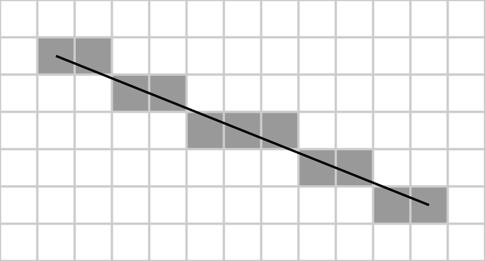
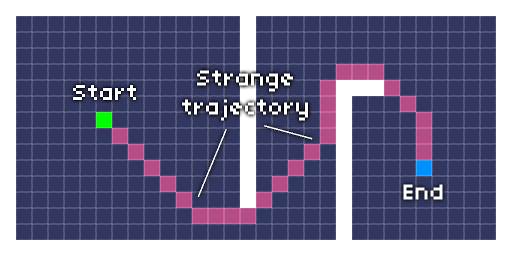
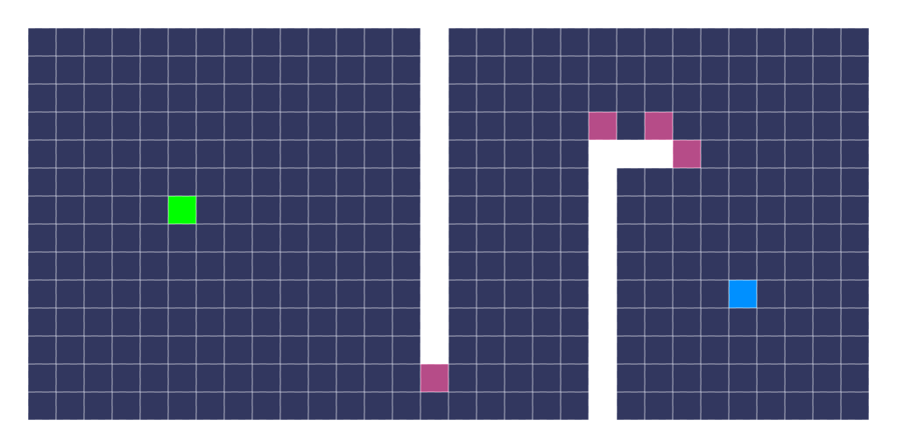
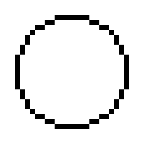
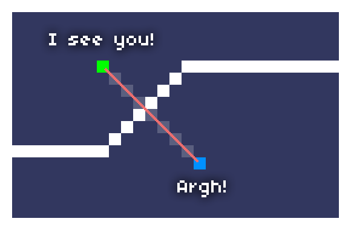

# [Bresenham magic: raycasting, line of sight…](https://deepnight.net/tutorials/bresenham-magic-raycasting-line-of-sight-pathfinding/)



Bresenham is a quite [common algorithm](http://en.wikipedia.org/wiki/Bresenham's_line_algorithm) I actually discovered only a few months ago. And it proved to be incredibly useful for many purposes.

This algorithm is basically used to **draw a line between 2 points in a grid based space** (ie. pixels). The result is a *pixel perfect* line, which is cool.

But this algorithm has also many other interesting usages:

- line of sight
- pathfinding optimization
- pathfinding smoothing
- field of vision (cone)
- lighting
- …


Here is the implementation I use in Haxe:

```haxe
function getLine(x0:Int, y0:Int, x1:Int, y1:Int) : Array<{x:Int, y:Int}> {
	var pts = [];
	var swapXY = fastAbs( y1 - y0 ) > fastAbs( x1 - x0 );
	var tmp : Int;
	if ( swapXY ) {
		// swap x and y
		tmp = x0; x0 = y0; y0 = tmp; // swap x0 and y0
		tmp = x1; x1 = y1; y1 = tmp; // swap x1 and y1
	}

	if ( x0 > x1 ) {
		// make sure x0 < x1
		tmp = x0; x0 = x1; x1 = tmp; // swap x0 and x1
		tmp = y0; y0 = y1; y1 = tmp; // swap y0 and y1
	}

	var deltax = x1 - x0;
	var deltay = fastFloor( fastAbs( y1 - y0 ) );
	var error = fastFloor( deltax / 2 );
	var y = y0;
	var ystep = if ( y0 < y1 ) 1 else -1;
	if( swapXY )
		// Y / X
		for ( x in x0 ... x1+1 ) {
			pts.push({x:y, y:x});
			error -= deltay;
			if ( error < 0 ) {
				y = y + ystep;
				error = error + deltax;
			}
		}
	else
		// X / Y
		for ( x in x0 ... x1+1 ) {
			pts.push({x:x, y:y});
			error -= deltay;
			if ( error < 0 ) {
				y = y + ystep;
				error = error + deltax;
			}
		}
	return pts;
}
```

Note that `fastAbs` and `fastFloor` are simple re-implementations of Math.abs and Math.floor (which are awfully slow, see [here](http://lab.polygonal.de/?p=81)):

```haxe
static inline function fastAbs(v:Int) : Int {
	return (v ^ (v >> 31)) - (v >> 31);
}

static inline function fastFloor(v:Float) : Int {
	return Std.int(v); // actually it's more "truncate" than "round to 0"
}
```

A few things to know about Bresenham algorithm:

- it’s simple to implement, quite fast and efficient,
- I’ve moved the `if( swapXY )` outside of the loop for *slightly* faster results (only on very large number of calls),
- the Array memory allocation (ie. `var pts = []`) is *not* free. You may want to specialize this function to your needs instead of pushing points into an Array.
- **the array order can vary**. This is really important! It means that the array returned can be either from x0,y0 to x1,y1, or the contrary ; it depends on the angle.

I encourage you to read the *normal* implementation of Bresenham on [Wikipedia](http://en.wikipedia.org/wiki/Bresenham's_line_algorithm#Optimization), especially if you plan to specialize its implementation to your needs. You will also find other interesting optimizations there.

So. What can we do with this algorithm?

## Artificial intelligence

When you write an AI for your monsters, you will often want to answer 2 basic questions:

- is the mob close to the player (basically, checking distances)
- **does he see the player?**

The second question is easily answered using a Bresenham algorithm to check if there is anything blocking sight between the monster and the player.

```haxe
function checkLine(x0:Int, y0:Int, x1:Int, y1:Int, rayCanPass:Int->Int->Bool) {
	var swapXY = fastAbs( y1 - y0 ) > fastAbs( x1 - x0 );
	var tmp : Int;
	if ( swapXY ) {
		// swap x and y
		tmp = x0; x0 = y0; y0 = tmp; // swap x0 and y0
		tmp = x1; x1 = y1; y1 = tmp; // swap x1 and y1
	}

	if ( x0 > x1 ) {
		// make sure x0 < x1
		tmp = x0; x0 = x1; x1 = tmp; // swap x0 and x1
		tmp = y0; y0 = y1; y1 = tmp; // swap y0 and y1
	}

	var deltax = x1 - x0;
	var deltay = fastFloor( fastAbs( y1 - y0 ) );
	var error = fastFloor( deltax / 2 );
	var y = y0;
	var ystep = if ( y0 < y1 ) 1 else -1;

	if( swapXY )
		// Y / X
		for ( x in x0 ... x1+1 ) {
			if( !rayCanPass(y,x) )
			return false;

			error -= deltay;
			if ( error < 0 ) {
				y = y + ystep;
				error = error + deltax;
			}
		}
	else
		// X / Y
		for ( x in x0 ... x1+1 ) {
			if( !rayCanPass(x,y) )
			return false;

			error -= deltay;
			if ( error < 0 ) {
				y = y + ystep;
				error = error + deltax;
			}
		}
	return true;
}
```

This version doesn’t returns an array of points, it just run a given function (**rayCanPass**) on every points in the line and if this given function returns false, then the whole checkLine returns false and stops.

Example:

```haxe
checkLine(
	mob.x, mob.y, 
	player.x, player.y,
	function(x,y) return collisionMap[x][y] == false
);
```

Neat and quite fast, especially because the loop stops if there is an obstacle. Note that **function calls in Flash are expensive** if you need to loop many times on checkLine, for example.

## Pathfinding optimization

When you write pathfinding algorithms (like *A-star*), you know by nature that calling them will be expensive in real-time games. So every time you can avoid a call to your pathfinder, it’s better to do so.

Using the previous example, if you can answer the question “does this mob see the player”, you can often skip useless pathfinding calls.

## Path smoothing

Many pathfinding algorithms return the complete list of points between START and END points, but also **stick to the grid**.

[](http://deepnight.net/wordpress/wp-content/uploads/2013/11/pathFinding01.png)

Bresenham can be used to very easily “smooth” this result. What you have to do is:

- set a point called REF which is equal to START to begin with,
- check if the REF points “sees” the 3rd point of the path. If so, remove 2nd point because it is basically useless.
- repeat by checking if REF points sees 4th point, etc.
- If the REF point cannot see a given point, then the previous point is useful and should be kept. In such a case, the REF is now that previous point and you can repeat the algorithm with the next points.

This way, you *clean* the path, only keeping successive points that see each other, and removing useless intermediaries.

[](http://deepnight.net/wordpress/wp-content/uploads/2013/11/pathFinding02.png)

## Field of vision (cone)

It’s easy to implement a cone of vision like in *Metal Gear Solid* or *Commando*.

To check if an enemy sees the player:

- check the **distance**,
- if in range, calculate the **angle** between the enemy and the player (Math.atan2)
- if the **angular distance** between this angle and the current direction of the enemy is less than the cone range / 2, run a **Bresenham** check
- if the player is not hidden by something… ALARM!

## Lighting

If you iterate **all points** within range around, say, a *Torch* in rogue-like game, you can use Bresenham again to check if the Torch sees this particular point. If so, you can lighten up this cell, and the intensity of this lighting is one minus the distance to the torch divided by the max range.

```haxe
var intensity = 1 - dist / maxDist; // 0=no light, 1=full light
```

It is incredibly **expensive** in realtime, because **you have to iterate every single points around each torch** to calculate your lightmap. But if you don’t need realtime, for example, if the torches don’t move dynamically, you can **precalculate** your lightings at the beginning of the game and the cost becomes negligible. And it’s *really simple* to implement.

```haxe
for (dx in -radius...radius+1)
	for(dy in -radius...radius+1) {
		var x = source.x + dx;
		var y = source.y + dy;

		var d = distance(source.x, source.y, x, y);
		if( d<=radius && checkLine(source.x,source.y, x,y, hasNoCollision) ){
			var intensity = 1 - d/radius;
			// update your lightmap, draw, ...
		}
	}
```

You can still have one dynamic lighting for your player, like in a roguelike, or only recalculate lighting when the player cell changes (ie. when he moves).

There is lots of room for optimizations here, but it all depends on your particular needs.

Here is an example of this very *naive* approach (**move your mouse over to try it**, Flash player needed). Almost no optimization:

[](http://deepnight.net/wordpress/wp-content/uploads/2013/11/bresenhamCircle.png)

## Pixel perfect circles

Bresenham algorithm is used to draw lines, but it can also **draw nice circles**. Actually, the author is *not* Bresenham himself, but the approach is heavily inspired.

It’s not as useful as the line thing, but it can be useful and it’s easy to implement. Read more about it on [Wikipedia](http://en.wikipedia.org/wiki/Midpoint_circle_algorithm).

## Something about the diagonals

Note that if your game has diagonal walls, the basic bresenham algorithm will “see” through them.

[](http://deepnight.net/wordpress/wp-content/uploads/2013/11/bresenhamDiagonals.png)

You can fix this by adding a few extra points during a check: each time the line “breaks” (ie. error < 0), you can check additional points around this break. The result is **thicker diagonals**, without affecting horizontal and vertical lines.