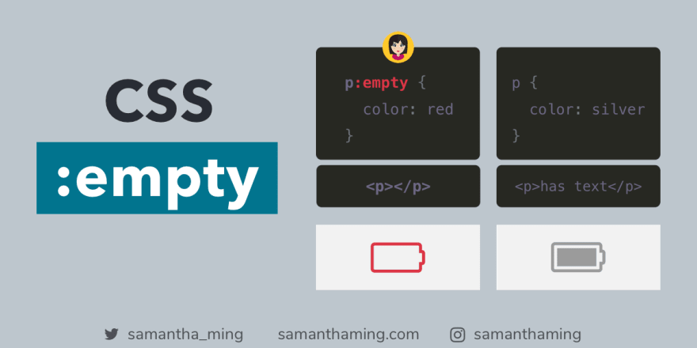
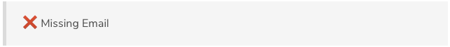
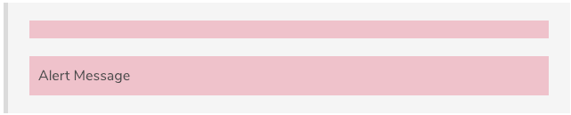
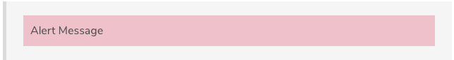

# CSS :empty Selector

[](https://res.cloudinary.com/practicaldev/image/fetch/s--56W9VoDY--/c_limit%2Cf_auto%2Cfl_progressive%2Cq_auto%2Cw_880/https://thepracticaldev.s3.amazonaws.com/i/bv28z2ws73wn3x3ieug6.png)

Often, we want to style elements that contain content. How about when an element has no children or text at all? Easy, you can use the `:empty` selector 🤩

```
<p> </p><!-- NOT empty: note the blank space -->
<p></p><!-- YES empty: nothing inbetween -->
p::before {
  font-family: "FontAwesome";
  content: "\f240";
}

p:empty::before {
  content: "\f244";
}

p {
  color: silver;
}

p:empty {
  color: red;
}
```

## What's considered empty?

When I first encounter this, there was a few confusion about what this property considers as **empty**. Let's stick with [MDN's](https://developer.mozilla.org/en-US/docs/Web/CSS/:empty) definition here:

> The :empty CSS pseudo-class represents any element that has no children. Children can be either element nodes or text (including whitespace). Comments, processing instructions, and CSS content do not affect whether an element is considered empty.

### Is empty

As long as there is no whitespace, it's an empty element.

```
<p></p>
```

Comment in between is also considered an empty element. As long as there is no whitespace.

```
<p><!-- comment --></p>
```

### Not empty

Whitespace is considered not empty. Even in a new line, there is whitespace, so not empty! Emphasizing on this, cause I made the same mistake 😅

```
<p> </p>

<p>
<!-- comment -->
</p>
```

Having children element also counts as not empty

```
<p><span></span></p>
```

## Examples using `:empty`

Okay, let's take a look at some real-life examples of using `:empty`.

### Using `:empty` in Form Error Message

This is the example that made me first discovered `:empty`. So I wanted to prepend a ❌ icon on my error message. But the problem is the icon appeared even when I had no error message. But then no problem, I can just use the `:empty` to only append the icon when there IS an error message 👍

***CSS\***

```
.error:before {
  color: red;
  content: "\0274c "; /* ❌ icon */
}
```

***HTML\***

```
<!-- No error message -->
<div class="error"></div>

<!-- Yes error message -->
<div class="error">Missing Email</div>
```

***Output\***

Without Empty

[](https://res.cloudinary.com/practicaldev/image/fetch/s--unvvWFYk--/c_limit%2Cf_auto%2Cfl_progressive%2Cq_auto%2Cw_880/https://thepracticaldev.s3.amazonaws.com/i/2xzodchws9c0aiqf3l13.png)

With `:empty`

[](https://res.cloudinary.com/practicaldev/image/fetch/s--ISFDA22X--/c_limit%2Cf_auto%2Cfl_progressive%2Cq_auto%2Cw_880/https://thepracticaldev.s3.amazonaws.com/i/0utd4hod0aqqd0irc5iy.png)

### Using `:empty` in Alerts

Here's another example using `:empty` to hide empty state.

```
.alert {
  background: pink;
  padding: 10px;
}
.alert:empty {
  display: none;
}
```

***HTML\***

```
<div class="alert"></div>
<div class="alert">Alert Message</div>
```

***Output\***

Without empty

[](https://res.cloudinary.com/practicaldev/image/fetch/s--asOtOyPf--/c_limit%2Cf_auto%2Cfl_progressive%2Cq_auto%2Cw_880/https://thepracticaldev.s3.amazonaws.com/i/8kti3ciiskkqo2f61k4n.png)

With `:empty`

[](https://res.cloudinary.com/practicaldev/image/fetch/s--ktqJZBFv--/c_limit%2Cf_auto%2Cfl_progressive%2Cq_auto%2Cw_880/https://thepracticaldev.s3.amazonaws.com/i/gn8urci86ngyn71lwhmu.png)

## 