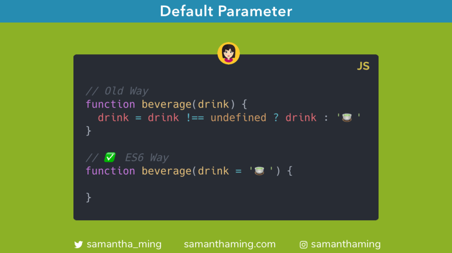

# Setting Default Parameters in JavaScipt

[

Super simple to set Default Parameters with ES6 👏‬ The old way was to use a ternary operator to assign the default value if it was undefined. With ES6, you can set the default value right inside the function parameters 🎉

```
// Old Way
function beverage(drink) {
  drink = drink !== undefined ? drink : '🍵';
}

// ✅ ES6 Way
function beverage(drink = '🍵') {}
```

## When the default value kicks in 🥾

The default value only kicks if no value or `undefined` is passed. Let's take a look:

```
function beverage(drink = '🍵') {
  return drink;
}

beverage(); // '🍵'
beverage(undefined); // '🍵'
```

### `undefined` vs other falsy values

Does the default value kick in for other falsy values? Great question! Let's take a look:

```
function beverage(drink = '🍵') {
  return drink;
}

beverage(false); // false
beverage(null); // null
beverage(NaN); // NaN
beverage(0); // 0
beverage(''); // ""
```

☝️The answer is NO. The default value only kicks in for `undefined`. All other times, the value that you passed through will take effect 🙂

### Setting Default Parameter for ALL falsy values

If you want to capture all falsy value, you might want to do something like this instead:

```
function beverage(drink) {
  drink = drink || 'default value';
  return drink;
}

beverage(); // 'default value'
beverage(undefined); // 'default value'
beverage(false); // 'default value'
beverage(null); // 'default value'
beverage(NaN); // 'default value'
beverage(0); // 'default value'
beverage(''); // 'default value'
```

## Default Parameter with Destucturing

You can also set default parameter with destructuring.

**Object Destructuring**

```
function beverage({ name } = { name: '🍵' }) {
  return name;
}

beverage(); // '🍵'
beverage({ name: '🥤' }); // '🥤'
```

**Array Desructuring**

```
function color([black] = ['#000']) {
  return black;
}

color(); // #000
color(['#222']); // #222
```

### Why is Default Parameter important for destructuring

Setting a default parameter is super important for destructuring. That's because if you try to destructure something that is `undefined`, it will throw an error. Yes, error is sometimes good because it's an indicator something is broken with your app so you better fix it. But sometimes, you prefer it fail gracefully so not to break your app.

Your app will crash if you try to destructure a value that is `undefined`.

```
const person = undefined;

const { name } = person;
// ❌ TypeError
```

But this is okay. You app will not crash.

```
const person = {};

const { name } = person;
// ✅ undefined (no crash)
```

#### Fixing `TypeError` in function with default parameter

Now let's apply this knowledge in our function world where we are destructuring our argument.

```
function beverage({ name }) {
  return name;
}

beverage();
// ❌ TypeError
```

That's why you will see a lot of functions setting a default parameter to avoid this crash.

```
function beverage({ name } = {}) {
  return name;
}

beverage();
// ✅ undefined (no crash)
```

## Does Default Parameter work with Arrow Functions

You bet! Default parameters can also be applied to arrow functions.

```
const beverage = (drink = '🍵') => drink;
```

In JavaScript, arrow functions have implicit and explicit returns. So the above is the same as:

```
const beverage = (drink = '🍵') => {
  return drink;
};
```

To learn more about arrow functions, you can read my [arrow function cheatsheet](https://www.samanthaming.com/tidbits/47-arrow-functions-cheatsheet/)

## Using parameter in your default parameter

Here's something really cool you could do! You can access **earlier** parameter in your **later** default parameter.

```
function metric(kilogram, gram = kilogram * 1000) {
  return gram;
}

metric(0.5); // 500
metric(0.5, 200); // 200
```

⚠️ Note: The parameters are processed left to right. So you won't be able to access later parameters in earlier paramters. So don't do this 🙅‍♀️

```
function metric(gram = kilogram * 1000, kilogram) {
  return gram;
}

metric(undefined, 200);
// ❌ ReferenceError:
```

## Best Practice

If you're following [Airbnb's JavaScript Style Guide](https://github.com/airbnb/javascript#functions--defaults-last), you should:

> Always put default parameters last.

```
// ❌ bad
function handleThings(opts = 'default', name) {}

// ✅ good
function handleThings(name, opts = 'default') {}
```

## Community Question

I listed this as the old way:

```
function beverage(drink) {
  drink = drink !== undefined ? drink : '🍵';
}
```

But many of you have stated the more popular old way is this:

```
function beverage(drink) {
  drink = drink || '🍵';
}
```

I picked the former way as the old way because it more closely aligns with the new way of setting default parameter. Remember I mentioned that the default parameter only kicks in when it's `undefined`. The latter way will capture ALL falsy values. The subtitles of coding, am I right 😂