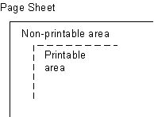
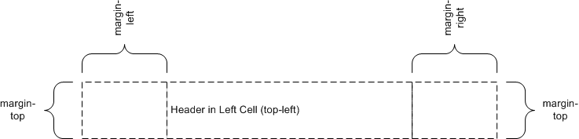
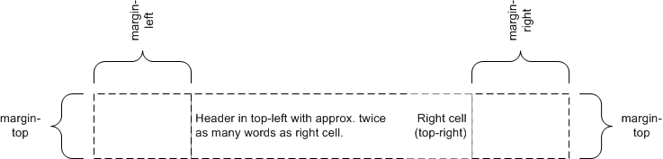

---
[https://www.w3.org/TR/css-page-3/](https://www.w3.org/TR/css-page-3/)
---

# CSS Paged Media Module Level 3

## 1. Introduction

Paged media (e.g., paper, transparencies, photo album pages, pages displayed on computer screens as printed output simulations) differ from [continuous media](https://www.w3.org/TR/CSS2/media.html#continuous-media-group) in that the content of the document is split into one or more discrete static display surfaces. To handle pages, CSS3 Paged Media describes how:

- [page breaks](https://www.w3.org/TR/css-page-3/#page-breaks) are created and avoided;
- the page properties such as size, orientation, margins, border, and padding are specified;
- headers and footers are established within the page margins;
- content such as page counters are placed in the headers and footers; and
- orphans and widows can be controlled.

This module defines a [page model](https://www.w3.org/TR/css-page-3/#page-model) that specifies how a document is formatted within a rectangular area, called the [page box](https://www.w3.org/TR/css-page-3/#page-box-page-rule), that has finite width and height.

Although CSS3 does not specify how user agents transfer page boxes to sheets, it does include certain mechanisms for telling user agents about the intended page sheet [size and orientation](https://www.w3.org/TR/css-page-3/#page-size). In the general case, CSS3 assumes that one page box will be transferred to one surface of similar size.

All properties defined in this specification also accept the [inherit](https://www.w3.org/TR/CSS21/cascade.html#value-def-inherit) keyword as their value, but for readability it has not been listed explicitly.

## 2. Page Terminology

The following terminology and accompanying diagrams help to describe the page model:

### Page sheet



The page sheet is one surface of the physical medium. The illustration to the right shows a representation of the upper-left corner of a page sheet.

### Printable and non-printable areas

The non-printable area is the area of a page sheet that a physical device such as a printer is not capable of marking reliably, usually due to the printer’s paper handling mechanism. This value is printer dependent and is usually a small region along each edge of the page sheet. The printable area is the area of page sheet that a printer *is* capable of marking reliably. The size of the printable area is the size of the page sheet reduced by the size of the non-printable area. A user agent may not know the dimensions of this area for a particular printing device; but when its dimensions are known, user agents may adjust the formatting of the document so that content falls within the printable area. How this adjustment is accomplished is device dependent within the constraints expressed in the sections [§7.4 Rendering page boxes that do not fit a page sheet](https://www.w3.org/TR/css-page-3/#renderingpages) and [§3.2 Content outside the page box](https://www.w3.org/TR/css-page-3/#content-outside-box).

### Page Orientation
The page orientation is defined by comparing the length of the edges of a [page box](https://www.w3.org/TR/css-page-3/#page-box). The page box is a rectangle with two perpendicular edges called the long edge and the short edge. The length of the long edge is always greater than or equal to the length of the short edge. When the page box is square, the two edges are of the same length and either can be used as the long edge with the other being the short edge. This specification defines page orientations of [portrait](https://www.w3.org/TR/css-page-3/#valdef-page-size-portrait) and [landscape](https://www.w3.org/TR/css-page-3/#valdef-page-size-landscape).

### Portrait Orientation
A portrait page’s height is greater than or equal to its width. Horizontal elements are parallel to the short edge and vertical elements to the long edge.

### Landscape Orientation
A landscape page’s width is greater than or equal to its height. Horizontal elements are parallel to the long edge and vertical elements to the short edge.
> Note: Note that CSS3 makes no distinction between landscape and reverse-landscape orientations. However, future versions of CSS may do so. UAs should consider, when formatting for duplexed printing, the binding edge, page progression, and ease of reading when choosing between landscape and reverse-landscape renderings.

### Duplex Printing
Duplex printing prints one page box per side of a page sheet and uses both sides of the page sheet. This module provides no ability to specify whether a document is duplex printed, but the concept of left and right pages is based on the assumption that the document is duplex printed, regardless of whether or not it actually is.

### Binding Edge
The binding edge is the edge of the page box that is toward the binding if the material is bound. The binding edge often has a larger margin than the opposite edge to provide for the space used by the binding. The binding edge can be any of the four edges. However, page sheets are customarily bound so that the binding edge of page boxes with portrait orientation is vertical. This module provides no method to specify the binding edge. In duplex printing, the binding edge is on opposite sides of the page box for the left and right pages.

### Facing Pages
Facing pages are two sequential pages such that when the document is duplex printed they are on separate sheets of paper. Typically, the earlier page will be the back side of one sheet and the later page will be the front side of another. They are usually laid out so that the binding edges of facing pages are vertical and adjacent when the pages are placed in their normal reading orientation.

### Left Page
A page that would be on the left if it is part of a pair of facing pages as typically laid out. Page layouts for documents using a left-to-right page progression have the earlier of the facing pages on the left. Rules specific to the left page can be specified using the `:left`.

### Right Page
A page that would be on the right if it is part of a pair of facing pages as typically laid out. Page layouts for documents using a right-to-left page progression have the earlier of the facing pages on the right. Rules specific to the right page can be specified using the `:right`.

## 3. The Page Model

In the paged media formatting model, the document is transferred into one or more page boxes. The page box is a specialized CSS box that maps to a rectangular print media surface, such as a page of paper. It is roughly analogous to the [viewport](https://www.w3.org/TR/CSS21/visuren.html#viewport).

As with other CSS [boxes](https://www.w3.org/TR/CSS21/box.html), a page box consists of margin, border, padding, and content areas. The content and margin areas of a page box have special functions:

 In CSS 2.1, both the page box and page area are simple rectangles. Neither is a CSS box with margins, borders, and padding. This CSS box should be distinct from the page box and page area, which would be its margin area and content area, respectively. Naming ideas?

- The content area of a page box is called the page area. The content of the document is flowed into one or more page boxes. The page area acts as a container for all the boxes generated by the root element and its descendants that are laid out within a given page box. The edges of the page area on the first page establish the rectangle that is the initial [containing block](https://www.w3.org/TR/css-page-3/#containing-block) of the document.
- The margin area of a page box is divided into 16 page-margin boxes. Each page-margin box has its own margin, border, padding and content areas. Page-margin boxes are typically used to display running headers and footers.

The properties of a [page box](https://www.w3.org/TR/css-page-3/#page-box) are determined by properties declared within the [page context](https://www.w3.org/TR/css-page-3/#page-context), which is the [declaration block](https://www.w3.org/TR/CSS21/syndata.html#x14) of the [@page](https://www.w3.org/TR/css-page-3/#at-ruledef-page) rule. Similarly the properties of a [page-margin box](https://www.w3.org/TR/css-page-3/#page-margin-boxes) are determined by properties declared within its [margin context](https://www.w3.org/TR/css-page-3/#margin-context). Declarations in the page context can affect the page box and/or inherit to the page-margin boxes, but they do not apply to or inherit into the document’s root element or other content.

The [containing block](https://www.w3.org/TR/css-page-3/#containing-block) of the page box is specified using the [size](https://www.w3.org/TR/css-page-3/#descdef-page-size) property in the [page context](https://www.w3.org/TR/css-page-3/#page-context). The width and horizontal margins of the page box are then calculated exactly as for a [non-replaced block element in normal flow](https://www.w3.org/TR/CSS21/visudet.html#blockwidth). [[CSS21\]](https://www.w3.org/TR/css-page-3/#biblio-css21) The height and vertical margins of the page box are calculated analogously (instead of using the block height formulas). In both cases if the values are over-constrained, instead of ignoring any margins, the containing block is resized to coincide with the margin edges of the page box.

### 3.1. Page Backgrounds and Painting Order

When drawing a page of content, the page layers are painted in the following painting order (bottommost first):

1. page background
2. document canvas
3. page borders
4. document contents
5. page-margin boxes

In the page model, the page background behaves similar to the root background: its [background painting area](https://www.w3.org/TR/css3-background/#background-painting-area) is the [bleed area](https://www.w3.org/TR/css-page-3/#bleed-area), which covers the entire page box, including its margins (regardless of [background-clip](https://www.w3.org/TR/css3-background/#propdef-background-clip)). Page backgrounds are anchored within the page box’s padding area by default (and honor [background-origin](https://www.w3.org/TR/css3-background/#propdef-background-origin) if the UA supports [[CSS3BG\]](https://www.w3.org/TR/css-page-3/#biblio-css3bg)). However if [background-attachment](https://www.w3.org/TR/css3-background/#propdef-background-attachment) is [fixed](https://www.w3.org/TR/css3-background/#valdef-background-attachment-fixed) then the image is positioned relative to the page box including its margins (i.e. the [background positioning area](https://www.w3.org/TR/css3-background/#background-positioning-area) is the page’s margin box).

The document canvas background is drawn as the page box’s background: by default its [background painting area](https://www.w3.org/TR/css3-background/#background-painting-area) covers the page box’s border box, and for UAs that support [[CSS3BG\]](https://www.w3.org/TR/css-page-3/#biblio-css3bg), follows the [background-clip](https://www.w3.org/TR/css3-background/#propdef-background-clip) value specified on the root element. It remains, however, positioned with respect to the root element or page area as usual.

With respect to the page-margin boxes, the document canvas, page borders, and all of the document contents are treated as a single element with a `z-index` value of 0 that establishes a [stacking context](https://www.w3.org/TR/css3-positioning/#stacking-context) [[CSS21\]](https://www.w3.org/TR/css-page-3/#biblio-css21): the page-margin boxes never interleave with parts of the document content or between the content and the canvas. They may only paint in front of the document content or behind the document canvas. The page background is always painted underneath everything else.

The [z-index](https://www.w3.org/TR/css3-positioning/#propdef-z-index) property applies to page-margin boxes. Since the [position](https://www.w3.org/TR/css3-positioning/#propdef-position) property does not apply to page-margin boxes, [z-index](https://www.w3.org/TR/css3-positioning/#propdef-z-index) always affects page-margin boxes as if they were positioned elements regardless of the [position](https://www.w3.org/TR/css3-positioning/#propdef-position) property’s value. Each page-margin boxes always establishes a stacking context.

The default painting order, or [CSS2.1 Appendix E](https://www.w3.org/TR/CSS21/zindex.html) "tree order", of page-margin boxes with respect to each other is as follows:

1. [@top-left-corner](https://www.w3.org/TR/css-page-3/#at-ruledef-top-left-corner)
2. [@top-left](https://www.w3.org/TR/css-page-3/#at-ruledef-top-left)
3. [@top-center](https://www.w3.org/TR/css-page-3/#at-ruledef-top-center)
4. [@top-right](https://www.w3.org/TR/css-page-3/#at-ruledef-top-right)
5. [@top-right-corner](https://www.w3.org/TR/css-page-3/#at-ruledef-top-right-corner)
6. [@right-top](https://www.w3.org/TR/css-page-3/#at-ruledef-right-top)
7. [@right-middle](https://www.w3.org/TR/css-page-3/#at-ruledef-right-middle)
8. [@right-bottom](https://www.w3.org/TR/css-page-3/#at-ruledef-right-bottom)
9. [@bottom-right-corner](https://www.w3.org/TR/css-page-3/#at-ruledef-bottom-right-corner)
10. [@bottom-right](https://www.w3.org/TR/css-page-3/#at-ruledef-bottom-right)
11. [@bottom-center](https://www.w3.org/TR/css-page-3/#at-ruledef-bottom-center)
12. [@bottom-left](https://www.w3.org/TR/css-page-3/#at-ruledef-bottom-left)
13. [@bottom-left-corner](https://www.w3.org/TR/css-page-3/#at-ruledef-bottom-left-corner)
14. [@left-bottom](https://www.w3.org/TR/css-page-3/#at-ruledef-left-bottom)
15. [@left-middle](https://www.w3.org/TR/css-page-3/#at-ruledef-left-middle)
16. [@left-top](https://www.w3.org/TR/css-page-3/#at-ruledef-left-top)

Start with [@top-left-corner](https://www.w3.org/TR/css-page-3/#at-ruledef-top-left-corner), then go clockwise. This order is arbitrary but can be overridden with [z-index](https://www.w3.org/TR/css3-positioning/#propdef-z-index). It only has a visible effect when page-margin boxes overlap, which should not happen in most cases.

### 3.2. Content outside the page box

When formatting content in the page model, some content may end up outside the page box. For example, an element whose [white-space](https://www.w3.org/TR/css-text-3/#propdef-white-space) property has the value [pre](https://www.w3.org/TR/css-text-3/#valdef-white-space-pre) can generate a box that is wider than the page box. As another example, when boxes are positioned absolutely or relatively, they may end up in "inconvenient" locations. For example, images may be placed on the edge of the page box or 100,000 meters below the page box.

A specification for the exact formatting of such elements lies outside the scope of this document. However, it is recommended that authors and user agents observe the following general principles concerning content outside the page box:

- Content should be allowed slightly beyond the page box to allow pages to "bleed".

- User agents

   

  SHOULD

   

  avoid generating a large number of content-empty pages to honor the positioning of elements (e.g., printing 100 blank pages is probably neither the author’s nor the user’s intent). A

   

  Content-empty page

   

  is a page box whose page area contains no printable content other than backgrounds and/or borders. A page box whose page area contains generated content, or content whose visibility is

   

  hidden

  , or invisible content such as a zero-width space is not a content-empty page. On the other hand, a page containing only a background and/or borders and/or page-margin box content

   

  is

   

  a content-empty page.

  Note, however, that generating a small number of empty page boxes is sometimes necessary to honor the forced-break values for [page-break-before](https://www.w3.org/TR/CSS21/page.html#propdef-page-break-before)/[break-before](https://www.w3.org/TR/css3-break/#propdef-break-before) and [page-break-after](https://www.w3.org/TR/CSS21/page.html#propdef-page-break-after)/[break-after](https://www.w3.org/TR/css3-break/#propdef-break-after). [[CSS21\]](https://www.w3.org/TR/css-page-3/#biblio-css21) [[CSS3-BREAK\]](https://www.w3.org/TR/css-page-3/#biblio-css3-break)

- Authors

   

  SHOULD NOT

   

  position elements in inconvenient locations just to avoid rendering them. Instead:

  - To suppress box generation entirely, set the [display](https://www.w3.org/TR/CSS21/visuren.html#propdef-display) property to [none](https://www.w3.org/TR/css-display-3/#valdef-display-none).
  - To make a box invisible, set the [visibility](https://www.w3.org/TR/CSS21/visufx.html#propdef-visibility) property.

- This specification does not define how boxes positioned outside the page box are handled. Possibilities include discarding them or creating page boxes for them at the end of the document.

### 3.3. Page Progression

CSS distinguishes between left pages and right pages on all documents, whether they are printed duplex or not. Each left page is followed by a right page and vice versa. Left and right pages can be styled differently with the [`:left` and `:right` pseudo-classes](https://www.w3.org/TR/css-page-3/#left-right-first).

Whether the first page of a document is a left page or a right page depends on the page progression of the document. The page progression is the direction in which the printed pages of a document would be sequenced when laid out side-to-side. For example, English and horizontally-set Japanese typically progress from left to right, whereas Arabic and vertically-set Japanese pages typically progress from right to left.

The page progression direction is determined as follows:

- If text is laid out in horizontal lines, the [page progression](https://www.w3.org/TR/css-page-3/#page-progression) is the same as the [inline base direction](https://www.w3.org/TR/css-writing-modes-4/#inline-base-direction).
- If text is laid out in vertical lines, the [page progression](https://www.w3.org/TR/css-page-3/#page-progression) is the same as the [block flow direction](https://www.w3.org/TR/css-writing-modes-4/#block-flow-direction).

If the UA supports the [direction](https://www.w3.org/TR/css-writing-modes-3/#propdef-direction) and [writing-mode](https://www.w3.org/TR/css-writing-modes-4/#propdef-writing-mode) properties from the CSS 3 Writing Modes Module [[CSS3-WRITING-MODES\]](https://www.w3.org/TR/css-page-3/#biblio-css3-writing-modes), it must [determine](https://www.w3.org/TR/css3-writing-modes/#page-direction) the [page progression](https://www.w3.org/TR/css-page-3/#page-progression) is determed by the [principal writing mode](https://www.w3.org/TR/css-writing-modes-4/#principal-writing-mode).

In documents with a left-to-right [page progression](https://www.w3.org/TR/css-page-3/#page-progression) the first page of the document is a right page, and vice versa. To explicitly force a document to begin printing on a left or right page, authors can specify a [break-before](https://www.w3.org/TR/css3-break/#propdef-break-before) value that that propagates a page break to the root. [[CSS3-BREAK\]](https://www.w3.org/TR/css-page-3/#biblio-css3-break) The UA must suppress the first (empty) page(s) in this case (and the `:first` pseudo-class matches the first printed page).


```
html { break-before: always }
```

For an HTML document with a left-to-right page progression, the above style rule will cause the first page of the document to print on a ':left' page

```
html { break-before: left }
```

For an HTML document, the above style rule will cause the first page of the document to print on a ':left' page, regardless of the page progression.

## 4. Page Selectors and the Page Context

### 4.1. The @page Rule

Authors can specify various aspects of a page box, such as its dimensions, orientation, and margins, within an @page rule. [@page](https://www.w3.org/TR/css-page-3/#at-ruledef-page) rules are allowed wherever [rule-sets](https://www.w3.org/TR/CSS21/syndata.html#rule-sets) are allowed. An [@page](https://www.w3.org/TR/css-page-3/#at-ruledef-page) rule consists of the keyword [@page](https://www.w3.org/TR/css-page-3/#at-ruledef-page), an optional comma-separated list of [page selectors](https://www.w3.org/TR/css-page-3/#page-selector) and a block of declarations (said to be in the page context). An [@page](https://www.w3.org/TR/css-page-3/#at-ruledef-page) rule can also contain other at-rules, interleaved between declarations. The current level of this specification only allows [margin at-rules](https://www.w3.org/TR/css-page-3/#margin-at-rule) inside [@page](https://www.w3.org/TR/css-page-3/#at-ruledef-page).

[@page](https://www.w3.org/TR/css-page-3/#at-ruledef-page) rules without a selector list apply to every page. Other [@page](https://www.w3.org/TR/css-page-3/#at-ruledef-page) rules apply to pages that [match](https://www.w3.org/TR/css-page-3/#match) at least one of their selectors. Properties declared within the page context apply to the page box.

If an error is encountered during the processing of a declaration block within a page or a margin context, the [Rules for handling parsing errors](https://www.w3.org/TR/CSS21/syndata.html#parsing-errors) apply; that is, valid declarations within the block are applied.

### 4.2. Page selectors

A page selector is made of either a [page type selector](https://www.w3.org/TR/css-page-3/#page-type-selector) or a [page pseudo-class](https://www.w3.org/TR/css-page-3/#page-pseudo-class), followed by zero or more additional [page pseudo-classes](https://www.w3.org/TR/css-page-3/#page-pseudo-class). No whitespace is allowed between components of a selector. The [](https://www.w3.org/TR/css-page-3/#typedef-page-selector) grammar and examples can be found below.

A [page selector](https://www.w3.org/TR/css-page-3/#page-selector) is said to match a given page if and only if all of its components match the page.

A page type selector is a case-sensitive [CSS identifier](https://www.w3.org/TR/CSS21/syndata.html#value-def-identifier) [[CSS21\]](https://www.w3.org/TR/css-page-3/#biblio-css21). It [matches](https://www.w3.org/TR/css-page-3/#match) pages of the [named page type](https://www.w3.org/TR/css-page-3/#using-named-pages) generated by the [page](https://www.w3.org/TR/css-page-3/#propdef-page) property. A page type name of auto ([ASCII case-insensitive](https://www.w3.org/TR/CSS21/syndata.html#characters)) does not make the rule invalid, but must never match.

A page pseudo-class is [ASCII case-insensitive](https://www.w3.org/TR/CSS21/syndata.html#characters) and has the same syntax as [pseudo-classes](https://www.w3.org/TR/selectors/#pseudo-classes) in regular Selectors. [[SELECT\]](https://www.w3.org/TR/css-page-3/#biblio-select) The various [page pseudo-classes](https://www.w3.org/TR/css-page-3/#page-pseudo-class) are defined below.

#### 4.2.1. Spread pseudo-classes: [:left](https://www.w3.org/TR/css-page-3/#valdef-page-left), [:right](https://www.w3.org/TR/css-page-3/#valdef-page-right)

When printing double-sided documents, left and right pages are often formatted differently. This can be expressed by using the [:left](https://www.w3.org/TR/css-page-3/#valdef-page-left) and [:right](https://www.w3.org/TR/css-page-3/#valdef-page-right) page pseudo-classes.

All pages are automatically classified by user agents as either left pages or right pages, based on [page progression](https://www.w3.org/TR/css-page-3/#progression). The :left and :right pseudo-classes only [match](https://www.w3.org/TR/css-page-3/#match) [left](https://www.w3.org/TR/css-page-3/#left-page) or [right pages](https://www.w3.org/TR/css-page-3/#right-page), respectively.

The following example creates left and right binding edges using these pseudo-classes:

```
@page :left {
margin-left: 3cm;
margin-right: 4cm;
}

@page :right {
margin-left: 4cm;
margin-right: 3cm;
}
```

If different declarations have been given for left and right pages, the user agent must honor these declarations even if the user agent does not transfer the page boxes to left and right sheets (i.e., a printer that only prints on one side of the medium must nevertheless produce correctly formatted output).

***Note.** Adding declarations to the [:left](https://www.w3.org/TR/css-page-3/#valdef-page-left) or [:right](https://www.w3.org/TR/css-page-3/#valdef-page-right) pseudo-class does not necessarily influence whether the document comes out of the printer double- or single-sided (which is outside the scope of this specification).*

#### 4.2.2. First-page pseudo-class: [:first](https://www.w3.org/TR/css-page-3/#valdef-page-first)

The :first pseudo-class [matches](https://www.w3.org/TR/css-page-3/#match) the first printed page of a document.


```
@page { margin: 2cm } /* All margins set to 2cm */

@page :first {
margin-top: 10cm /* Top margin on first page 10cm */
}
```

#### 4.2.3. Blank-page pseudo-class: [:blank](https://www.w3.org/TR/css-page-3/#valdef-page-blank)

The :blank pseudo-class [matches](https://www.w3.org/TR/css-page-3/#match) [content-empty pages](https://www.w3.org/TR/css-page-3/#content-empty) that appear as a result of [forced page breaks](https://www.w3.org/TR/css3-break/#forced-breaks).

Only the [left](https://www.w3.org/TR/css3-break/#valdef-break-before-left), [right](https://www.w3.org/TR/css3-break/#valdef-break-before-right), [recto](https://www.w3.org/TR/css3-break/#valdef-break-before-recto) and [verso](https://www.w3.org/TR/css3-break/#valdef-break-before-verso) values of the [break-before](https://www.w3.org/TR/css3-break/#propdef-break-before) and [break-after](https://www.w3.org/TR/css3-break/#propdef-break-after) properties can generate pages that match [:blank](https://www.w3.org/TR/css-page-3/#valdef-page-blank).

In this example, forced page break may occur before `h1` elements.

```
h1 { break-before: left }

@page :blank {
  @top-center { content: "This page is intentionally left blank" }
}
```

A page matched by [:blank](https://www.w3.org/TR/css-page-3/#valdef-page-blank) can also be matched by other page pseudo-classes.


If headers have been specified on all right pages, a blank right page will be matched by both `:blank` and `:right`. Therefore, margin boxes set on right pages will have to be removed unless they are wanted on blank pages. Here is an example where the top center header is removed from blank pages, while the page number remains:

```
h1 { break-before: left }

@page :blank {
  @top-center { content: none }
}

@page :right {
  @top-center { content: "Preliminary edition" }
  @bottom-center { content: counter(page) }
}
```

Due to the higher [specificity](https://www.w3.org/TR/css-page-3/#specificity) of `:blank` over `:right`, the top center header is removed even if `content: none` comes before `content: "Preliminary edition"`.

***Note.** Future versions of CSS may include other page pseudo-classes.*

### 4.3. @page rule grammar

[@page](https://www.w3.org/TR/css-page-3/#at-ruledef-page) rules are [parsed](https://drafts.csswg.org/css-syntax-3/#parse-grammar) according to the following grammar, plus the additional rules noted below:

```
@page = @page <page-selector-list>? { <declaration-list> }
<page-selector-list> = <page-selector>#
<page-selector> = [ <ident-token>? <pseudo-page>* ]!
<pseudo-page> = ':' [ left | right | first | blank ]

/* Margin rules */
@top-left-corner = @top-left-corner { <declaration-list> };
@top-left = @top-left { <declaration-list> };
@top-center = @top-center { <declaration-list> };
@top-right = @top-right { <declaration-list> };
@top-right-corner = @top-right-corner { <declaration-list> };
@bottom-left-corner = @bottom-left-corner { <declaration-list> };
@bottom-left = @bottom-left { <declaration-list> };
@bottom-center = @bottom-center { <declaration-list> };
@bottom-right = @bottom-right { <declaration-list> };
@bottom-right-corner = @bottom-right-corner { <declaration-list> };
@left-top = @left-top { <declaration-list> };
@left-middle = @left-middle { <declaration-list> };
@left-bottom = @left-bottom { <declaration-list> };
@right-top = @right-top { <declaration-list> };
@right-middle = @right-middle { <declaration-list> };
@right-bottom = @right-bottom { <declaration-list> };
```

In addition, the following rules apply:

- No whitespace is allowed between the productions in [](https://www.w3.org/TR/css-page-3/#typedef-page-selector) or [](https://www.w3.org/TR/css-page-3/#typedef-pseudo-page) (similar to the rule for [](https://www.w3.org/TR/selectors4/#typedef-compound-selector)).
- The [@page](https://www.w3.org/TR/css-page-3/#at-ruledef-page) rule can only contain [page properties](https://www.w3.org/TR/css-page-3/#page-property) and [margin at-rules](https://www.w3.org/TR/css-page-3/#margin-at-rule).
- The [margin at-rules](https://www.w3.org/TR/css-page-3/#margin-at-rule) can only contain [page-margin properties](https://www.w3.org/TR/css-page-3/#page-margin-property).

The following are examples of page selectors (declaration block intentionally left blank)

```
@page { ... }
@page :left { ... }
@page :right { ... }
@page LandscapeTable { ... }
@page CompanyLetterHead:first { ... } /*  identifier and pseudo page. */
@page:first { ... }
@page toc, index { ... }
@page :blank:first { ... }
```

The following are examples of page-margin boxes where the declaration blocks are intentionally left blank.

```
@page {
 @top-left { ... /* document name */ }
 @bottom-center { ... /* page number */}
}
@page :left { @left-middle { ... /* page number in left margin */ }}
@page :right{ @right-middle { ... /* page number in right margins of right pages */}}

@page :left { @bottom-left-corner { ... /* left page numbers */ }}
@page :right { @bottom-right-corner { ... /* right page numbers */ }}
@page :first { @bottom-left-corner { ... /* empty footer on 1st page */ }
@bottom-right-corner { ... /* empty footer */ } }
```

### 4.4. Cascading in the page context

Declarations in page and margin contexts [cascade](https://www.w3.org/TR/CSS21/cascade.html) just like declarations in style rule for elements.

The specificity of page a selector is computed in a manner analogous to the computations defined in the [Selectors](https://www.w3.org/TR/CSS21/selector.html) module:

- Count the number of page type names (=

   

  f

  )

  Given the syntax of page selectors, f can only ever be 0 or 1.

- Count the number of ':first' or ':blank' pseudo-classes (= g)

- Count the number of ':left' or ':right' pseudo-classes (= h)

Note: Repeated occurrences of the same pseudo-classes are allowed and do increase specificity.

Due to storage limitations, implementations may have limitations on the size of f, g, or h. If so, values higher than the limit must be clamped to that limit, and not overflow.

Specificities are compared by comparing the three components in order (f, g, h): the specificity with a larger f value is more specific; if the two f values are tied, then the two g values are compared, etc. If all the values are tied, the two specificities are equal.


Some page specificity calculation examples follow:

```
@page { } /* specificity = (0,0,0) */
@page :left { } /* specificity = (0,0,1) */
@page :first { } /* specificity = (0,1,0) */
@page :blank:left { } /* specificity = (0,1,1) */
@page artsy { } /* specificity = (1,0,0) */
@page artsy:left { } /* specificity = (1,0,1) */
@page artsy:first { } /* specificity = (1,1,0) */
```


Consider the following usage example:

```
@page :left {
  margin-left: 4cm;
}

@page {
  margin-left: 3cm;
}
```

Due to the higher specificity of the pseudo-class selector, the left margin on left pages will be 4cm and all other pages (the right-facing pages) will have a left margin of 3cm.

In this example, the higher specificity of the green rules wins over the red rule. Therefore the first page will have blue text in the top-left page-margin box and green text in the top-right page-margin box, while subsequent pages will have red text in the page-margin boxes.

```
@page :first {
  color: green;

  @top-left {
    content: "foo";
    color: blue;
  }
  @top-right {
    content: "bar";
  }
}

@page { color: red;
  @top-center {
    content: "Page " counter(page);
  }
}
```


Page contexts cascade, so the following stylesheet would style pages with 25 millimeter margins and 14 point type in the page-margin boxes:

```
@page { margin: 25mm;}
@page { font-size: 14pt;}
```

## 5. Page-Margin Boxes

Page-margin boxes are boxes within the page margin that, like pseudo-elements, can contain generated content.

Page-margin boxes can be used to create page headers and footers, which are portions of the page set aside for supplementary information such as the page number or document title.

Typically, a page header is located at the top of the page in documents with a predominately horizontal writing direction and on the side opposite the [binding edge](https://www.w3.org/TR/css-page-3/#binding-edge) for documents with a predominately vertical writing direction. One possible design of page headers for horizontally written documents uses the [@top-left-corner](https://www.w3.org/TR/css-page-3/#at-ruledef-top-left-corner), [@top-left](https://www.w3.org/TR/css-page-3/#at-ruledef-top-left), [@top-center](https://www.w3.org/TR/css-page-3/#at-ruledef-top-center), [@top-right](https://www.w3.org/TR/css-page-3/#at-ruledef-top-right) and [@top-right-corner](https://www.w3.org/TR/css-page-3/#at-ruledef-top-right-corner) page-margin boxes. Another design, for vertically written documents, could use the [@right-top](https://www.w3.org/TR/css-page-3/#at-ruledef-right-top), [@right-middle](https://www.w3.org/TR/css-page-3/#at-ruledef-right-middle), and [@right-bottom](https://www.w3.org/TR/css-page-3/#at-ruledef-right-bottom) page-margin boxes for [right facing pages](https://www.w3.org/TR/css-page-3/#right-page) and [@left-top](https://www.w3.org/TR/css-page-3/#at-ruledef-left-top), [@left-middle](https://www.w3.org/TR/css-page-3/#at-ruledef-left-middle), and [@left-bottom](https://www.w3.org/TR/css-page-3/#at-ruledef-left-bottom) for [left facing pages](https://www.w3.org/TR/css-page-3/#left-page).

The page footer is typically at the opposite end of the page from the page header. For example, the design of a horizontally written document with a page header at the top of the page could use the [@bottom-left-corner](https://www.w3.org/TR/css-page-3/#at-ruledef-bottom-left-corner), [@bottom-left](https://www.w3.org/TR/css-page-3/#at-ruledef-bottom-left), [@bottom-center](https://www.w3.org/TR/css-page-3/#at-ruledef-bottom-center), [@bottom-right](https://www.w3.org/TR/css-page-3/#at-ruledef-bottom-right) and [@bottom-right-corner](https://www.w3.org/TR/css-page-3/#at-ruledef-bottom-right-corner) page-margin boxes as the page footer. The design of a vertically written document could use the page-margin boxes of the binding edge of the page for the page footer.

Page-margin boxes are positioned with respect to the page area and are independent of page orientation, for example the top page-margin boxes are above the page area in both portrait and landscape orientation. The various page-margin boxes are defined and illustrated in the diagram below:

| Box                 | Description                                                  | Placement                                                    |
| ------------------- | ------------------------------------------------------------ | ------------------------------------------------------------ |
| top-left-corner     | a fixed-size box defined by the intersection of the top and left margins of the page box |  |
| top-left            | a variable-width box filling the top page margin between the top-left-corner and top-center page-margin boxes |  |
| top-center          | a variable-width box centered horizontally between the page’s left and right border edges and filling the page top margin between the top-left and top-right page-margin boxes |  |
| top-right           | a variable-width box filling the top page margin between the top-center and top-right-corner page-margin boxes |  |
| top-right-corner    | a fixed-size box defined by the intersection of the top and right margins of the page box |  |
| left-top            | a variable-height box filling the left page margin between the top-left-corner and left-middle page-margin boxes |  |
| left-middle         | a variable-height box centered vertically between the page’s top and bottom border edges and filling the left page margin between the left-top and left-bottom page-margin boxes |                                                              |
| left-bottom         | a variable-height box filling the left page margin between the left-middle and bottom-left-corner page-margin boxes |                                                              |
| right-top           | a variable-height box filling the right page margin between the top-right-corner and right-middle page-margin boxes |  |
| right-middle        | a variable-height box centered vertically between the page’s top and bottom border edges and filling the right page margin between the right-top and right-bottom page-margin boxes |                                                              |
| right-bottom        | a variable-height box filling the right page margin between the right-middle and bottom-right-corner page-margin boxes |                                                              |
| bottom-left-corner  | a fixed-size box defined by the intersection of the bottom and left margins of the page box |  |
| bottom-left         | a variable-width box filling the bottom page margin between the bottom-left-corner and bottom-center page-margin boxes |  |
| bottom-center       | a variable-width box centered horizontally between the page’s left and right border edges and filling the bottom page margin between the bottom-left and bottom-right page-margin boxes |  |
| bottom-right        | a variable-width box filling the bottom page margin between the bottom-center and bottom-right-corner page-margin boxes |  |
| bottom-right-corner | a fixed-size box defined by the intersection of the bottom and right margins of the page box |  |

### 5.1. At-rules for page-margin boxes

Page-margin boxes are created by [margin at-rules](https://www.w3.org/TR/css-page-3/#margin-at-rule) inside the [page context](https://www.w3.org/TR/css-page-3/#page-context). Authors should put these rules after any declarations in the page context as legacy clients may not handle declarations after margin at-rules correctly.

A margin at-rule is an [at-rule](https://www.w3.org/TR/css-syntax-3/#at-rule) that identifies the page-margin box (e.g. [@top-left](https://www.w3.org/TR/css-page-3/#at-ruledef-top-left)) and a block of descriptors (said to be in the margin context).


The following style sheet establishes a page header containing the title ("Hamlet") on the left side and the page number, preceded by "Page ", on the right side:

```
@page {
  size: 8.5in 11in;
  margin: 10%;

  @top-left {
    content: "Hamlet";
  }
  @top-right {
    content: "Page " counter(page);
  }
}
```

### 5.2. Populating page-margin boxes

As with the :before and :after pseudo-elements, a specified [content: normal](https://www.w3.org/TR/css-content-3/#propdef-content) on a page-margin box computes to [none](https://www.w3.org/TR/css-content-3/#content-property). A page-margin box is generated if and only if the computed value of its [content](https://www.w3.org/TR/css-content-3/#propdef-content) property is not [none](https://www.w3.org/TR/css-content-3/#content-property). Otherwise, no box is generated, as for elements with [display: none](https://www.w3.org/TR/CSS21/visuren.html#propdef-display).

The [display](https://www.w3.org/TR/CSS21/visuren.html#propdef-display) property does not apply to page-margin boxes.

The following style sheet creates a green box in each corner of the page except the bottom-left corner.

```
@page {
  @top-left-corner { content: " "; border: solid green; }
  @top-right-corner { content: url(foo.png); border: solid green; }
  @bottom-right-corner { content: counter(page); border: solid green; }
  @bottom-left-corner { content: normal; border: solid green; }
}
```

### 5.3. Computing Page-margin Box Dimensions

The width and height of each page-margin box is determined by the rules below. These rules define the equivalent of CSS2.1 Sections 10.3 and 10.6 for page-margin boxes.

The rules for applying [min-height](https://www.w3.org/TR/CSS21/visudet.html#propdef-min-height), [max-height](https://www.w3.org/TR/CSS21/visudet.html#propdef-max-height), [min-width](https://www.w3.org/TR/CSS21/visudet.html#propdef-min-width), and [max-width](https://www.w3.org/TR/CSS21/visudet.html#propdef-max-width) [[CSS21\]](https://www.w3.org/TR/css-page-3/#biblio-css21) do apply to page-margin boxes and may imply a recalculation of the width, height, and/or margins if the dimensions resulting from the specified [width](https://www.w3.org/TR/CSS21/visudet.html#propdef-width) or [height](https://www.w3.org/TR/CSS21/visudet.html#propdef-height) violate their constraints. If the UA does not support the [min-height](https://www.w3.org/TR/CSS21/visudet.html#propdef-min-height) or [min-width](https://www.w3.org/TR/CSS21/visudet.html#propdef-min-width) properties then it must behave as if [min-height](https://www.w3.org/TR/CSS21/visudet.html#propdef-min-height) and [min-width](https://www.w3.org/TR/CSS21/visudet.html#propdef-min-width) were always zero.

#### 5.3.1. Page-Margin Box Layout Terminology

In addition to the box model definitions in CSS2.1 [[CSS21\]](https://www.w3.org/TR/css-page-3/#biblio-css21), and the sizing terms in CSS Intrinsic Sizing [[CSS3-SIZING\]](https://www.w3.org/TR/css-page-3/#biblio-css3-sizing), the following terms are defined for use in the subsequent page-margin box calculations:

- available width

  The sum of the page’s left border width, left padding, [page area](https://www.w3.org/TR/css-page-3/#page-box) width, right padding, and right border width. In other words, it is the distance between the [page box](https://www.w3.org/TR/css-page-3/#page-box)’s left right border edges. This quantity is used when calculating dimensions of the top and bottom page-margin boxes.

- available height

  The sum of the page’s top border width, top padding, [page area](https://www.w3.org/TR/css-page-3/#page-box) height, bottom padding, and bottom border width. In other words, it is the distance between the [page box](https://www.w3.org/TR/css-page-3/#page-box)’s top bottom border edges. This quantity is used when calculating dimensions of the left and right page-margin boxes.

- outer width

  The width of the [outer edge](https://www.w3.org/TR/css-box-3/#outer-edge), as defined in [[CSS-BOX-3\]](https://www.w3.org/TR/css-page-3/#biblio-css-box-3).

- min-content width

  Whichever of [min-content block size](https://www.w3.org/TR/css-sizing-3/#min-content-block-size) or [min-content inline size](https://www.w3.org/TR/css-sizing-3/#min-content-inline-size) is the physical width.

- max-content width

  Whichever of [max-content block size](https://www.w3.org/TR/css-sizing-3/#max-content-block-size) or [max-content inline size](https://www.w3.org/TR/css-sizing-3/#max-content-inline-size) is the physical width.

- outer min width

  Like the [outer width](https://www.w3.org/TR/css-page-3/#outer-width), except the [min-content width](https://www.w3.org/TR/css-page-3/#min-content-width) is used when the computed [width](https://www.w3.org/TR/CSS21/visudet.html#propdef-width) is [auto](https://www.w3.org/TR/css-sizing-3/#valdef-width-auto).

- outer max width

  Like the [outer width](https://www.w3.org/TR/css-page-3/#outer-width), except the [max-content width](https://www.w3.org/TR/css-page-3/#max-content-width) is used when the computed [width](https://www.w3.org/TR/CSS21/visudet.html#propdef-width) is [auto](https://www.w3.org/TR/css-sizing-3/#valdef-width-auto).

The containing block for a page-margin box depends on its location:

For a corner page-margin box, it is the rectangle defined by the intersection of the two page margins meeting at that corner.

For all other page-margin boxes, the [containing block](https://www.w3.org/TR/css-page-3/#containing-block) is the rectangle formed by the encapsulating page margin minus the containing blocks of the adjacent corners' page-margin boxes. This means that the size of this containing block is given in one dimension by the used page margin and in the other dimension by the [available width](https://www.w3.org/TR/css-page-3/#available-width) (for top and bottom page-margin boxes) or [available height](https://www.w3.org/TR/css-page-3/#available-height) (for left and right page-margin boxes).

#### 5.3.2. Page-Margin Box Variable Dimension Computation Rules

The following rules apply to [@top-left](https://www.w3.org/TR/css-page-3/#at-ruledef-top-left), [@top-center](https://www.w3.org/TR/css-page-3/#at-ruledef-top-center) and [@top-right](https://www.w3.org/TR/css-page-3/#at-ruledef-top-right) page-margin boxes, which are referred to as A, B, and C, respectively, in this section.

##### 5.3.2.1. Margins

If the [margin-left](https://www.w3.org/TR/css-box-3/#propdef-margin-left) or [margin-right](https://www.w3.org/TR/css-box-3/#propdef-margin-right) property of any of the three boxes computes to auto, the used value is zero.

##### 5.3.2.2. Resolving [auto](https://www.w3.org/TR/css-sizing-3/#valdef-width-auto) widths

The following algorithm determines the used width of each box. For this purpose, boxes that are not [generated](https://www.w3.org/TR/css-page-3/#generated) are assumed to have a [width](https://www.w3.org/TR/CSS21/visudet.html#propdef-width) and an [outer width](https://www.w3.org/TR/css-page-3/#outer-width) of zero.

Note: The high-level goals are (in order of priority) to center the middle box (B) if it is generated, to minimize overflow and overlap, and to distribute space proportionally to the amount of content.

If the middle box (B) is not [generated](https://www.w3.org/TR/css-page-3/#generated), distribute the [available width](https://www.w3.org/TR/css-page-3/#available-width) to A and C as follows:

- If only one box has 'width: auto', its used width is resolved so that the sum of the [outer width](https://www.w3.org/TR/css-page-3/#outer-width)s equals [available width](https://www.w3.org/TR/css-page-3/#available-width).

- 

  If A and C both have 'width: auto', distribute the space to each box as follows:

  1. If the sum of the outer [max-content widths](https://www.w3.org/TR/css-page-3/#max-content-width) is less than the [available width](https://www.w3.org/TR/css-page-3/#available-width), call that difference the flex space. Calculate each box’s flex factor as proportional to its outer [max-content width](https://www.w3.org/TR/css-page-3/#max-content-width), and set its used outer width to: `max-content width + flex space × flex factor ÷ ∑flex factors`
  2. Otherwise if the sum of the outer [min-content widths](https://www.w3.org/TR/css-page-3/#min-content-width) is less than the [available width](https://www.w3.org/TR/css-page-3/#available-width), call that difference the [flex space](https://www.w3.org/TR/css-page-3/#flex-space) calculate each box’s [flex factor](https://www.w3.org/TR/css-page-3/#flex-factor) as proportional to its [max-content width](https://www.w3.org/TR/css-page-3/#max-content-width) minus [min-content width](https://www.w3.org/TR/css-page-3/#min-content-width), and set its used outer width to: `min-content width + flex space × flex factor ÷ ∑flex factors`
  3. Otherwise, calculate its outer size as in the previous case, but set each box’s [flex factor](https://www.w3.org/TR/css-page-3/#flex-factor) as proportional to its outer [min-content width](https://www.w3.org/TR/css-page-3/#min-content-width).

  In each case, both

   

  flex factors

   

  are assumed to be

   

  1

   

  if their sum is equal to zero.

If the middle box (B) is [generated](https://www.w3.org/TR/css-page-3/#generated), determine the [auto](https://www.w3.org/TR/css-sizing-3/#valdef-width-auto) widths of A, B, and C as follows:

1. First, resolve any [auto](https://www.w3.org/TR/css-sizing-3/#valdef-width-auto) width of the middle box (B): Assume there are two boxes, B and AC, where each of AC’s dimensions is double the maximum of A and C. (This preserves B’s centering.) Distribute the space to these two boxes (B and the imaginary AC) as described for A and C [above](https://www.w3.org/TR/css-page-3/#flex-fit).
2. Then, resolve any [auto](https://www.w3.org/TR/css-sizing-3/#valdef-width-auto) widths of the side boxes (A and C) by setting that box’s outer width to `(available width − used outer widths of B) ÷ 2`

##### 5.3.2.3. Handling [min-width](https://www.w3.org/TR/CSS21/visudet.html#propdef-min-width) and [max-width](https://www.w3.org/TR/CSS21/visudet.html#propdef-max-width)

The [min-width](https://www.w3.org/TR/CSS21/visudet.html#propdef-min-width) and [max-width](https://www.w3.org/TR/CSS21/visudet.html#propdef-max-width) properties [[CSS21\]](https://www.w3.org/TR/css-page-3/#biblio-css21) apply to page-margin boxes in the variable dimension like on normal elements, except that the three boxes on the same side are considered together.

More precisely:

1. The tentative used widths are calculated (without [min-width](https://www.w3.org/TR/CSS21/visudet.html#propdef-min-width) and [max-width](https://www.w3.org/TR/CSS21/visudet.html#propdef-max-width)) following the rules under [§5.3.2.2 Resolving auto widths](https://www.w3.org/TR/css-page-3/#variable-auto-sizing).
2. If the tentative used width of any of the three boxes is greater than [max-width](https://www.w3.org/TR/CSS21/visudet.html#propdef-max-width), the rules above are applied again, but this time using the computed value of [max-width](https://www.w3.org/TR/CSS21/visudet.html#propdef-max-width) as the computed value for [width](https://www.w3.org/TR/CSS21/visudet.html#propdef-width).
3. If the resulting width of any of the three boxes is smaller than [min-width](https://www.w3.org/TR/CSS21/visudet.html#propdef-min-width), the rules above are applied again, but this time using the value of [min-width](https://www.w3.org/TR/CSS21/visudet.html#propdef-min-width) as the computed value for [width](https://www.w3.org/TR/CSS21/visudet.html#propdef-width).

##### 5.3.2.4. Positioning

Once the dimensions of the boxes are determined, they are positioned as follows:

- The left outer edge of A is flush with the left edge of the containing block
- The outer area of B is centered in the containing block.
- The right outer edge of C is flush with the right edge of the containing block.

##### 5.3.2.5. Boxes on other sides

The used values for [@bottom-left](https://www.w3.org/TR/css-page-3/#at-ruledef-bottom-left), [@bottom-center](https://www.w3.org/TR/css-page-3/#at-ruledef-bottom-center) and [@bottom-right](https://www.w3.org/TR/css-page-3/#at-ruledef-bottom-right) page-margin boxes are established by the same rules as for [@top-left](https://www.w3.org/TR/css-page-3/#at-ruledef-top-left), [@top-center](https://www.w3.org/TR/css-page-3/#at-ruledef-top-center), and [@top-right](https://www.w3.org/TR/css-page-3/#at-ruledef-top-right), respectively.

The used values for [@left-top](https://www.w3.org/TR/css-page-3/#at-ruledef-left-top), [@left-middle](https://www.w3.org/TR/css-page-3/#at-ruledef-left-middle) and [@left-bottom](https://www.w3.org/TR/css-page-3/#at-ruledef-left-bottom) boxes are established by the same rules, with "width" replaced by "height", "left" by "top", "right" by "bottom" and "center" by "middle".

The used values for [@right-top](https://www.w3.org/TR/css-page-3/#at-ruledef-right-top), [@right-middle](https://www.w3.org/TR/css-page-3/#at-ruledef-right-middle) and [@right-bottom](https://www.w3.org/TR/css-page-3/#at-ruledef-right-bottom) page-margin boxes are established by the same rules as for [@left-top](https://www.w3.org/TR/css-page-3/#at-ruledef-left-top), [@left-middle](https://www.w3.org/TR/css-page-3/#at-ruledef-left-middle) and [@left-bottom](https://www.w3.org/TR/css-page-3/#at-ruledef-left-bottom), respectively.

#### 5.3.3. Page-Margin Box Fixed Dimension Computation Rules

The rules below are used to calculate the used values of each [@top-left-corner](https://www.w3.org/TR/css-page-3/#at-ruledef-top-left-corner), [@top-left](https://www.w3.org/TR/css-page-3/#at-ruledef-top-left), [@top-center](https://www.w3.org/TR/css-page-3/#at-ruledef-top-center), [@top-right](https://www.w3.org/TR/css-page-3/#at-ruledef-top-right), and [@top-right-corner](https://www.w3.org/TR/css-page-3/#at-ruledef-top-right-corner) page-margin box’s [height](https://www.w3.org/TR/CSS21/visudet.html#propdef-height), [margin-top](https://www.w3.org/TR/css-box-3/#propdef-margin-top), and [margin-bottom](https://www.w3.org/TR/css-box-3/#propdef-margin-bottom) properties:

1. The following constraint must hold among the used values of the margin box’s properties:

   [margin-top](https://www.w3.org/TR/css-box-3/#propdef-margin-top) + [border-top-width](https://www.w3.org/TR/css3-background/#propdef-border-top-width) + [padding-top](https://www.w3.org/TR/css-box-3/#propdef-padding-top) + [height](https://www.w3.org/TR/CSS21/visudet.html#propdef-height) + [padding-bottom](https://www.w3.org/TR/css-box-3/#propdef-padding-bottom) + [border-bottom-width](https://www.w3.org/TR/css3-background/#propdef-border-bottom-width) + [margin-bottom](https://www.w3.org/TR/css-box-3/#propdef-margin-bottom) = top page margin

2. If [border-top-width](https://www.w3.org/TR/css3-background/#propdef-border-top-width) + [padding-top](https://www.w3.org/TR/css-box-3/#propdef-padding-top) + [height](https://www.w3.org/TR/CSS21/visudet.html#propdef-height) (if it is not [auto](https://www.w3.org/TR/css-sizing-3/#valdef-width-auto)) + [padding-bottom](https://www.w3.org/TR/css-box-3/#propdef-padding-bottom) + [border-bottom-width](https://www.w3.org/TR/css3-background/#propdef-border-bottom-width), plus [margin-top](https://www.w3.org/TR/css-box-3/#propdef-margin-top) and/or [margin-bottom](https://www.w3.org/TR/css-box-3/#propdef-margin-bottom) if not auto, is larger than the height of the top page margin, then any auto values for [margin-top](https://www.w3.org/TR/css-box-3/#propdef-margin-top) or [margin-bottom](https://www.w3.org/TR/css-box-3/#propdef-margin-bottom) are, for the following rules, treated as zero.

3. If at this point all of [height](https://www.w3.org/TR/CSS21/visudet.html#propdef-height), [margin-top](https://www.w3.org/TR/css-box-3/#propdef-margin-top), and [margin-bottom](https://www.w3.org/TR/css-box-3/#propdef-margin-bottom) have a computed value other than [auto](https://www.w3.org/TR/css-sizing-3/#valdef-width-auto), the values are said to be "over-constrained". In this case, the specified value of [margin-top](https://www.w3.org/TR/css-box-3/#propdef-margin-top) is treated as auto.

4. If there is now exactly one value specified as auto, its used value follows from the equality.

5. If [height](https://www.w3.org/TR/CSS21/visudet.html#propdef-height) is set to [auto](https://www.w3.org/TR/css-sizing-3/#valdef-width-auto), any other auto values become 0 and [height](https://www.w3.org/TR/CSS21/visudet.html#propdef-height) follows from the resulting equality

6. If both [margin-top](https://www.w3.org/TR/css-box-3/#propdef-margin-top) and [margin-bottom](https://www.w3.org/TR/css-box-3/#propdef-margin-bottom) are auto, their used values are equal. This vertically centers the page-margin box content within the top page margin.

The same rules apply to the bottom page-margin boxes (bottom-left-corner, bottom-left, bottom-center, bottom-right, and bottom-right-corner), except that in the overconstrained case, the [margin-bottom](https://www.w3.org/TR/css-box-3/#propdef-margin-bottom) is ignored rather than the [margin-top](https://www.w3.org/TR/css-box-3/#propdef-margin-top).

Analogous rules govern the properties for the left and right page-margin boxes with respect to [width](https://www.w3.org/TR/CSS21/visudet.html#propdef-width) (top-left-corner, left-top, left-middle, left-bottom, and bottom-left-corner; top-right-corner, right-top, right-middle, right-bottom, bottom-right-corner), with "top" replaced by "left", "bottom" replaced by "right", and "height" replaced by "width". In the overconstrained case for left (right) page-margin boxes, the specified value of [margin-left](https://www.w3.org/TR/css-box-3/#propdef-margin-left) ([margin-right](https://www.w3.org/TR/css-box-3/#propdef-margin-right)) is ignored.

### 5.4. Page-margin box examples

The following is a collection of examples of page-margin box usage.

Here is an example of a page with only a top-left header:

```
@page {
  @top-left { content: "Header in Left Cell (top-left)" }
}
```

Because there are no contents defined for the top-center or the top-right page-margin boxes, the extent of the top-left page-margin box is allowed to cross the center of the page box.



The following is an example of a page with a centered header:

```
@page {
  @top-center { content: "Header in Center Cell (top-center)" }
}
```


The following is an example of a page with a single header in the top-right page-margin box:

```
@page {
  @top-right { content: "Header in Right Cell (top-right)" }
}
```

Because the content of the center cell is empty, the extent of the top-right page-margin box is allowed to cross the center of the page box.


The following is an example of a page with a top-center and a top-left header:

```
@page {
  @top-left { content: "Left Cell (top-left)" }
  @top-center { content: "Header in Center Cell (top-center)" }
}
```


The following is an example of a page with a top-center and a top-right header:

```
@page {
  @top-center { content: "Header in Center Cell (top-center)" }
  @top-right { content: "Right Cell (top-right)" }
}
```

margin: 10%;


The following is an example of a page with top-left and top-right headers:

```
@page {
  @top-left { content: "Header in top-left with approx. twice as many words as right cell." }
  @top-right { content: "Right cell (top-right)" }
}
```

Because there are no center cell contents, the extent of the top-left is allowed to cross the center of the page box.



## 6. Page Properties

[Appendix A](https://www.w3.org/TR/css-page-3/#properties-list) defines the normative list of CSS 2.1 [[CSS21\]](https://www.w3.org/TR/css-page-3/#biblio-css21) [properties that apply to page boxes](https://www.w3.org/TR/css-page-3/#page-property-list). If a conforming user agent supports any of these properties on block boxes, then it must also support that property in the [page context](https://www.w3.org/TR/css-page-3/#page-context). This specification additionally defines the [size](https://www.w3.org/TR/css-page-3/#descdef-page-size) property that only applies in the page context.

Properties that apply to the page-margin boxes can also be set within the page context: if inheritable or explicitly inherited (with the [inherit](https://www.w3.org/TR/css-cascade-4/#valdef-all-inherit) keyword in the margin context), they will inherit to the page-margin boxes.

The same appendix defines the normative list of CSS 2.1 [[CSS21\]](https://www.w3.org/TR/css-page-3/#biblio-css21) [properties that apply to page-margin boxes](https://www.w3.org/TR/css-page-3/#page-property-list). If a conforming user agent supports any of these properties on block boxes, then it must also support that property in the [margin context](https://www.w3.org/TR/css-page-3/#margin-context).

Other properties defined by [[CSS21\]](https://www.w3.org/TR/css-page-3/#biblio-css21) do not apply in these contexts. Behavior for properties not included in CSS 2.1 is undefined.

Note: The intent of leaving other properties undefined is to allow the gradual addition of appropriate CSS3 properties as they emerge, without having to update this specification with each addition.

[As with elements in the document](https://www.w3.org/TR/CSS21/cascade.html#value-stages), both the page context and the margin context have a computed value for every property, even if that property does not apply to the page or page-margin box.

The normal rules for CSS properties apply with the following exceptions:

- page-margin boxes inherit from the page context. The page context inherits from the root element. However, since the previous revision of CSS Paged Media Level 3 did not specify this point, an implementation that sets inherited properties in the page context to their initial values (as for the root element) is also conformant to CSS Paged Media Level 3. Note that this exception will be removed in Level 4.
- Values in units of [em](https://www.w3.org/TR/css-values-4/#em) and [ex](https://www.w3.org/TR/css-values-4/#ex) are interpreted relative to the font associated with their context. When used on the [font-size](https://www.w3.org/TR/css-fonts-3/#propdef-font-size) property in the margin context, they are relative to the font of the page context. When used on the [font-size](https://www.w3.org/TR/css-fonts-3/#propdef-font-size) property in the page context, they are relative to the [font-size](https://www.w3.org/TR/css-fonts-3/#propdef-font-size) of the root element. However, since a previous revision of CSS Paged Media Level 3 was ambiguous on this point, an implementation that treats [em](https://www.w3.org/TR/css-values-4/#em) and [ex](https://www.w3.org/TR/css-values-4/#ex) on [font-size](https://www.w3.org/TR/css-fonts-3/#propdef-font-size) as relative to the initial value is also conformant to CSS Paged Media Level 3. Note that this exception will be removed in Level 4.
- Percentage values on the margin and padding properties are relative to the dimensions of the containing block. For right and left values, percentages are relative to the width of the containing block; for top and bottom values, percentages are relative to the height of the containing block.
- The used values of [width](https://www.w3.org/TR/CSS21/visudet.html#propdef-width) and [height](https://www.w3.org/TR/CSS21/visudet.html#propdef-height) have special computation rules for page boxes and page-margin boxes; see [Page Size](https://www.w3.org/TR/css-page-3/#page-size) and [Computing Page-Margin Box Dimensions](https://www.w3.org/TR/css-page-3/#margin-dimension).
- The page background is positioned and painted [as described above](https://www.w3.org/TR/css-page-3/#painting).
- The rules for counter scoping are modified [as described below](https://www.w3.org/TR/css-page-3/#page-based-counters).
- As on the '::before' and '::after' pseudo-elements, the [normal](https://www.w3.org/TR/css-content-3/#content-property) value of the [content](https://www.w3.org/TR/css-content-3/#propdef-content) property computes to [none](https://www.w3.org/TR/css-content-3/#content-property) on page-margin boxes.
- On page-margin boxes, the [vertical-align](https://www.w3.org/TR/css-inline-3/#propdef-vertical-align) property behaves [as specified for table cells](https://www.w3.org/TR/CSS21/tables.html#height-layout). It *always* performs alignment in the vertical dimension, regardless of writing mode.

User agents should establish a default page margin via the user agent stylesheet that includes any non-printable area. Authors should assume that the default page area will not include unprintable regions.

### 6.1. Page-based counters

Counters can be defined and controlled within an [@page](https://www.w3.org/TR/css-page-3/#at-ruledef-page) rule, and used as content in page-margin boxes. This is useful for maintaining a page count.

A [counter-increment](https://www.w3.org/TR/CSS21/generate.html#propdef-counter-increment) within either a page or margin context causes the counter to increment with the generation of each page box.

If a counter is reset or incremented within the page context, it is in scope for all page-margin boxes and obscures all counters of the same name within the document.

If a counter is reset or incremented within a margin context, it is in scope for that page-margin box and obscures any counters of the same name in both the page context and the document.

If a counter that has not been reset or incremented within the margin context or the page context is used by counter() or counters() in the margin context, then the resultant value is exactly as if the page-margin box were an element within the document at the start of the page, inside the deepest element in the normal flow that spans the page break. Use of the counter in this way does not affect the calculation of the counter’s value.

A counter named page is automatically created and incremented by 1 on every page of the document, unless the [counter-increment](https://www.w3.org/TR/CSS21/generate.html#propdef-counter-increment) property in the [page context](https://www.w3.org/TR/css-page-3/#page-context) explicitly specifies a different increment for the page counter. The implied page counter is a real counter, and can be directly affected using the [counter-increment](https://www.w3.org/TR/CSS21/generate.html#propdef-counter-increment) and [counter-reset](https://www.w3.org/TR/CSS21/generate.html#propdef-counter-reset) properties when named explicitly in those properties. It can also be used in the 'counter()' and 'counters()' function forms.

The following rules result in the placement of the current page number in the middle of the outside margin of each page.

```
@page {
  margin: 10%;

  @top-center {
    font-family: sans-serif;
    font-weight: bold;
    font-size: 2em;
    content: counter(page);
  }
}
```

Adding the following rule will make all pages even-numbered.

```
@page {
  counter-increment: page 2;
}
```

Additionally, a counter named pages is automatically created by the UA. Its value is always the total number of pages in the document. (In continuous media this is always 1.) The value of pages cannot be manipulated: while [counter-reset](https://www.w3.org/TR/CSS21/generate.html#propdef-counter-reset) and [counter-increment](https://www.w3.org/TR/CSS21/generate.html#propdef-counter-increment) statements that set it are valid, they have no effect.

In all other respects, page-associated counters behave as described in [[CSS21\]](https://www.w3.org/TR/css-page-3/#biblio-css21), [Nested Counters and Scope](https://www.w3.org/TR/CSS21/generate.html#scope) and [Counters](https://www.w3.org/TR/CSS21/syndata.html#counter).

### 6.2. Page-margin boxes and default values

Properties used within page or margin contexts take their initial values from their respective property definitions; however, user agents must behave as though the values in the following table were established by rules in the UA default style sheet.

| Page-margin box                                              | [text-align](https://www.w3.org/TR/css-text-3/#propdef-text-align) | [vertical-align](https://www.w3.org/TR/css-inline-3/#propdef-vertical-align) |
| ------------------------------------------------------------ | ------------------------------------------------------------ | ------------------------------------------------------------ |
| [top-left-corner](https://www.w3.org/TR/css-page-3/#top-left-corner-box-def) | right                                                        | middle                                                       |
| [top-left](https://www.w3.org/TR/css-page-3/#top-left-box-def) | left                                                         | middle                                                       |
| [top-center](https://www.w3.org/TR/css-page-3/#top-center-box-def) | center                                                       | middle                                                       |
| [top-right](https://www.w3.org/TR/css-page-3/#top-right-box-def) | right                                                        | middle                                                       |
| [top-right-corner](https://www.w3.org/TR/css-page-3/#top-right-corner-box-def) | left                                                         | middle                                                       |
| [left-top](https://www.w3.org/TR/css-page-3/#left-top-box-def) | center                                                       | top                                                          |
| [left-middle](https://www.w3.org/TR/css-page-3/#left-middle-box-def) | center                                                       | middle                                                       |
| [left-bottom](https://www.w3.org/TR/css-page-3/#left-bottom-box-def) | center                                                       | bottom                                                       |
| [right-top](https://www.w3.org/TR/css-page-3/#right-top-box-def) | center                                                       | top                                                          |
| [right-middle](https://www.w3.org/TR/css-page-3/#right-middle-box-def) | center                                                       | middle                                                       |
| [right-bottom](https://www.w3.org/TR/css-page-3/#right-bottom-box-def) | center                                                       | bottom                                                       |
| [bottom-left-corner](https://www.w3.org/TR/css-page-3/#bottom-left-corner-box-def) | right                                                        | middle                                                       |
| [bottom-left](https://www.w3.org/TR/css-page-3/#bottom-left-box-def) | left                                                         | middle                                                       |
| [bottom-center](https://www.w3.org/TR/css-page-3/#bottom-center-box-def) | center                                                       | middle                                                       |
| [bottom-right](https://www.w3.org/TR/css-page-3/#bottom-right-box-def) | right                                                        | middle                                                       |
| [bottom-right-corner](https://www.w3.org/TR/css-page-3/#bottom-right-corner-box-def) | left                                                         | middle                                                       |

This example style sheet could be used to create a centered header with the current chapter name:

```
body {counter-reset: chapter;}
div.chapter {counter-increment: chapter;}
@page {
  margin: 10%;
  @top-center { content: "Chapter" counter(chapter) }
}
```

## 7. Page Size

People around the world use many different paper sizes. It is a goal of this specification that web content should be adaptable to a range of different sizes without having to write a specific style sheet for each paper size.

However, in some situations it is important that a certain page size achieves a certain style. One way to achieve this goal is to utilize the [size](https://www.w3.org/TR/css-page-3/#descdef-page-size) property, which indicates that the document should preferentially be displayed on a surface of a certain size; another method is to use Media Queries [[MEDIAQ\]](https://www.w3.org/TR/css-page-3/#biblio-mediaq) which allow different style sheets to be applied to different page sizes.

### 7.1. Page size: the [size](https://www.w3.org/TR/css-page-3/#descdef-page-size) property

| Name:           | size                                                         |
| --------------- | ------------------------------------------------------------ |
| For:            | [@page](https://www.w3.org/TR/css-page-3/#at-ruledef-page)   |
| Value:          | [](https://www.w3.org/TR/css3-values/#length-value)[{1,2}](https://www.w3.org/TR/css-values-4/#mult-num-range) [\|](https://www.w3.org/TR/css-values-4/#comb-one) auto [\|](https://www.w3.org/TR/css-values-4/#comb-one) [ [](https://www.w3.org/TR/css-page-3/#typedef-page-size-page-size) [\|\|](https://www.w3.org/TR/css-values-4/#comb-any) [ portrait [\|](https://www.w3.org/TR/css-values-4/#comb-one) landscape ] ] |
| Initial:        | auto                                                         |
| Computed value: | specified value, with [](https://www.w3.org/TR/css3-values/#length-value)s made absolute. |

This property specifies the target size and orientation of the [page box](https://www.w3.org/TR/css-page-3/#page-box)’s containing block. In the general case, where one page box is rendered onto one [page sheet](https://www.w3.org/TR/css-page-3/#page-sheet), the [size](https://www.w3.org/TR/css-page-3/#descdef-page-size) property also indicates the size of the destination page sheet.

The size of a page box can either be "absolute" (fixed size) or "scalable" (i.e., fitting available sheet sizes). The first three values in the table below can be used to create scalable page boxes. Other values define a fixed-size page box, and thereby indicate the preferred output media size. When possible, output should be rendered on the media size indicated. If the specified size is not available, the rules for [transposing a page box to a different size](https://www.w3.org/TR/css-page-3/#renderingpages) apply.

If a [size](https://www.w3.org/TR/css-page-3/#descdef-page-size) property declaration is qualified by a width, height, device-width, device-height, aspect-ratio, device-aspect-ratio or orientation media query [[MEDIAQ\]](https://www.w3.org/TR/css-page-3/#biblio-mediaq) (or other conditional on the size of the paper), then the declaration must be [ignored](https://www.w3.org/TR/CSS21/conform.html#ignore). Media queries do not honor [size](https://www.w3.org/TR/css-page-3/#descdef-page-size): they assume the paper size that would be chosen if no [@page](https://www.w3.org/TR/css-page-3/#at-ruledef-page) rules were specified.

 It would be useful if media queries could respond at least to sizes specified on an unqualified @page.

Another option could be to do like [@viewport](https://www.w3.org/TR/css-device-adapt/#at-ruledef-viewport) rules [[CSS-DEVICE-ADAPT\]](https://www.w3.org/TR/css-page-3/#biblio-css-device-adapt): First apply [@page](https://www.w3.org/TR/css-page-3/#at-ruledef-page) rules (matching which selectors?), using the UA’s default page size for Media Queries and [viewport-percentage lengths](https://www.w3.org/TR/css3-values/#viewport-relative-lengths) [[CSS3VAL\]](https://www.w3.org/TR/css-page-3/#biblio-css3val). The resulting page size is the "base page size". The entire set of stylesheets is applied again, this time using the "base page size" for Media Queries and viewport-percentage lengths.

In the following example

```
@page {
  size: 4in 6in;
}

@media (max-width: 6in) {
  @page {
    size: letter;
  }
}
```

The second `size` declaration is ignored, i.e. the specified value of the `size` property is `4in 6in`.

- auto

  The page box will be set to a size and orientation chosen by the UA. In the usual case, the page box size and orientation is chosen to match the target media sheet.

- landscape

  Specifies that the page’s content be printed in landscape orientation. The longer sides of the page box are horizontal. If a [](https://www.w3.org/TR/css-page-3/#typedef-page-size-page-size) is not specified, the size of the page sheet is chosen by the UA.

- portrait

  Specifies that the page’s content be printed in portrait orientation. The shorter sides of the page box are horizontal. If a [](https://www.w3.org/TR/css-page-3/#typedef-page-size-page-size) is not specified, the size of the page sheet is chosen by the UA.

- [](https://www.w3.org/TR/css3-values/#length-value)

  The page box will be set to the given absolute dimension(s). If only one length value is specified, it sets both the width and height of the page box (i.e., the box is a square). If two length values are specified, the first establishes the page box width, and the second the page box height. Values in units of [em](https://www.w3.org/TR/css-values-4/#em) and [ex](https://www.w3.org/TR/css-values-4/#ex) refer to the page context’s font. Negative lengths are illegal.

- [](https://www.w3.org/TR/css-page-3/#typedef-page-size-page-size)

  A page size can be specified using one of the following media names. This is the equivalent of specifying [size](https://www.w3.org/TR/css-page-3/#descdef-page-size) using length values. The definition of the the media names comes from Media Standardized Names [[PWGMSN\]](https://www.w3.org/TR/css-page-3/#biblio-pwgmsn).A5Equivalent to the size of ISO A5 media: 148mm wide and 210 mm high.A4Equivalent to the size of ISO A4 media: 210 mm wide and 297 mm high.A3Equivalent to the size of ISO A3 media: 297mm wide and 420mm high.B5Equivalent to the size of ISO B5 media: 176mm wide by 250mm high.B4Equivalent to the size of ISO B4 media: 250mm wide by 353mm high.JIS-B5Equivalent to the size of JIS B5 media: 182mm wide by 257mm high.JIS-B4Equivalent to the size of JIS B4 media: 257mm wide by 364mm high.letterEquivalent to the size of North American letter media: 8.5 inches wide and 11 inches highlegalEquivalent to the size of North American legal: 8.5 inches wide by 14 inches high.ledgerEquivalent to the size of North American ledger: 11 inches wide by 17 inches high.

The [](https://www.w3.org/TR/css-page-3/#typedef-page-size-page-size) names can be used in conjunction with [landscape](https://www.w3.org/TR/css-page-3/#valdef-page-size-landscape) or [portrait](https://www.w3.org/TR/css-page-3/#valdef-page-size-portrait) to indicate both size and orientation.


```
@page {
size: A4 landscape;
}
```

The above example sets the width of the page box to be 297mm and the height to be 210mm. The page box in this example should be rendered on a page sheet size of 210 mm by 297 mm.

In the following example, the outer edges of the page box will align with the page. The percentage value on the [margin](https://www.w3.org/TR/CSS21/box.html#propdef-margin) property is relative to the page size so if the page sheet dimensions are 210mm x 297mm (i.e., A4), the margins are 21mm and 29.7mm. Assuming there are no page borders or padding set in the UA default style sheet, the resulting page area is 189mm by 367.3mm (210mm-21mm by 297mm-29.7mm).

```
@page {
size: auto;/* auto is the initial value */
margin: 10%;
}
```


```
@page {
size: 8.5in 11in;/* width height */
}
```

The above example sets the width of the page box to be 8.5 inches and the height to be 11 inches. This indicates that the page sheet size should be 8.5"x11" and the orientation [portrait](https://www.w3.org/TR/css-page-3/#valdef-page-size-portrait).

#### 7.1.1. Media Queries

*This section is informative.*

By using Media Queries [[MEDIAQ\]](https://www.w3.org/TR/css-page-3/#biblio-mediaq), one style sheet can express different stylistic preferences for different page sizes. Consider this example:


```
/* style sheet for "A4" printing */
@media print and (width: 21cm) and (height: 29.7cm) {
  @page {
     margin: 3cm;
  }
 }

/* style sheet for "letter" printing */
@media print and (width: 8.5in) and (height: 11in) {
  @page {
  margin: 1in;
  }
}
```

In the example above, "A4" sheets are given a "3cm" page margin, and "letter" sheets are given a "1in" page margin.

### 7.2. Crop and Registration Marks: the [marks](https://www.w3.org/TR/css-page-3/#descdef-page-marks) property

| Name:           | marks                                                        |
| --------------- | ------------------------------------------------------------ |
| For:            | [@page](https://www.w3.org/TR/css-page-3/#at-ruledef-page)   |
| Value:          | none [\|](https://www.w3.org/TR/css-values-4/#comb-one) [ crop [\|\|](https://www.w3.org/TR/css-values-4/#comb-any) cross ] |
| Initial:        | none                                                         |
| Computed value: | as specified                                                 |

This property adds crop and/or registration marks to the document. These are printed outside the page box to facilitate the trimming and alignment of sheets of paper. Values have the following meanings:

- none

  Specifies that neither crop marks nor registration marks should be printed: the area outside the [bleed area](https://www.w3.org/TR/css-page-3/#bleed-area) will be completely blank.

- crop

  Specifies that crop marks should be printed. These are typically short lines outside the page box that are effectively extensions of the page box’s four edges, thereby indicating the precise location of those edges without placing any ink near or within the page box itself.

- cross

  Specifies that registration marks should be printed. These are typically cross-shaped marks outside each edge of the page box used to align sheets of paper during the printing process.

Note that crop marks and registration marks are only visible if the page box is smaller than the printable area.

To set crop and cross marks on a document, this code can be used:

```
@page { marks: crop cross }
```

### 7.3. Bleed Area: the [bleed](https://www.w3.org/TR/css-page-3/#descdef-page-bleed) property

| Name:           | bleed                                                        |
| --------------- | ------------------------------------------------------------ |
| For:            | [@page](https://www.w3.org/TR/css-page-3/#at-ruledef-page)   |
| Value:          | auto [\|](https://www.w3.org/TR/css-values-4/#comb-one) [](https://www.w3.org/TR/css3-values/#length-value) |
| Initial:        | auto                                                         |
| Computed value: | as specified                                                 |

This property specifies the extent of the bleed area outside the page box; in other words the extent beyond the page box at which the page rendering is clipped. Values have the following meanings:

- auto

  Computes to 6pt if [marks](https://www.w3.org/TR/css-page-3/#descdef-page-marks) has [crop](https://www.w3.org/TR/css-page-3/#valdef-page-marks-crop) and to zero otherwise.

- [](https://www.w3.org/TR/css3-values/#length-value)

  Specifies by how far outward, in each direction, the [bleed area](https://www.w3.org/TR/css-page-3/#bleed-area) extends past the [page box](https://www.w3.org/TR/css-page-3/#page-box). Values may be negative, but there may be implementation-specific limits.

### 7.4. Rendering page boxes that do not fit a page sheet

If a page box does not match the target page sheet dimensions, the user agent should do one of the following (in order of preference):

1. Render the page box at the indicated size on a larger page sheet.
2. Rotate the page box 90° if this will make the page box fit the page sheet.
3. Scale the page box to fit the page sheet. (The aspect ratio of the page box should be preserved.)
4. Graphically "slice" the page box onto multiple page sheets.
5. Clip overflowed content (least preferred).

The user agent may wish to consult the user before performing these operations.

### 7.5. Positioning the page box on the sheet

When the page box is smaller than the page sheet, the user agent should either:

- center the page box on the sheet since this will align double-sided pages and avoid accidental loss of information that is printed near the edge of the sheet; or
- position the page box in the upper left corner of the page sheet (or another corner, based on the [direction](https://www.w3.org/TR/css-writing-modes-3/#propdef-direction) and [writing-mode](https://www.w3.org/TR/css-writing-modes-4/#propdef-writing-mode) properties of the page box) as this may minimize media consumption.

The user agent may wish to consult the user in this regard.

## 8. Page Breaks

The CSS Fragmentation Module [[CSS3-BREAK\]](https://www.w3.org/TR/css-page-3/#biblio-css3-break) module defines how and where CSS boxes can be *fragmented*, including across page breaks. It defines a few properties that indicate where the user agent may or must break pages, and on what page (left or right) the subsequent content resumes. Each page break ends layout in the current [page box](https://www.w3.org/TR/css-page-3/#page-box) and causes remaining pieces of the document tree to be laid out in a new page box.

### 8.1. Using named pages: [page](https://www.w3.org/TR/css-page-3/#propdef-page)

| Name:                                                        | page                                                         |
| ------------------------------------------------------------ | ------------------------------------------------------------ |
| [Value:](https://www.w3.org/TR/css-values/#value-defs)       | auto [\|](https://www.w3.org/TR/css-values-4/#comb-one) [](https://www.w3.org/TR/css-values-4/#identifier-value) |
| [Initial:](https://www.w3.org/TR/css-cascade/#initial-values) | auto                                                         |
| Applies to:                                                  | boxes that create [class A](https://www.w3.org/TR/css3-break/#btw-blocks) break points |
| [Inherited:](https://www.w3.org/TR/css-cascade/#inherited-property) | no (but see prose)                                           |
| [Percentages:](https://www.w3.org/TR/css-values/#percentages) | n/a                                                          |
| [Computed value:](https://www.w3.org/TR/css-cascade/#computed) | specified value                                              |
| Canonical order:                                             | per grammar                                                  |
| [Animation type:](https://www.w3.org/TR/web-animations-1/#animating-properties) | discrete                                                     |

The [page](https://www.w3.org/TR/css-page-3/#propdef-page) property is used to specify a particular type of page (called a named page) on which an element must be displayed. If necessary, a [forced page break](https://www.w3.org/TR/css3-break/#forced-break) is introduced and a new page generated of the specified type.

Note: This page can be styled by using the same type name in a [page selector](https://www.w3.org/TR/css-page-3/#page-selectors).

Page type names are case-sensitive identifiers. However the auto value, being a CSS keyword, is [ASCII case-insensitive](https://www.w3.org/TR/CSS21/syndata.html#characters).

The [page](https://www.w3.org/TR/css-page-3/#propdef-page) property does not inherit. However, if the [page](https://www.w3.org/TR/css-page-3/#propdef-page) value on an element is auto, then its used value is the value specified on its nearest ancestor with a non-auto value. When specified on the root element, the used value for auto is the empty string.

Because a previous version of this specification indicated that the [page](https://www.w3.org/TR/css-page-3/#propdef-page) property is inherited, an implementation that inherits the [page](https://www.w3.org/TR/css-page-3/#propdef-page) property and treats auto as always naming the empty string remains conformant to CSS Paged Media Level 3. Note that this exception will be removed in Level 4. Therefore authors should not explicitly specify the auto value on a descendant of an element with a non-auto value, as the resulting behavior will be unpredictable.

The [page](https://www.w3.org/TR/css-page-3/#propdef-page) property works as follows:

1. First, any auto values are resolved against non-auto ancestors (as specified above).

2. Next, a

    

   start [page](https://www.w3.org/TR/css-page-3/#propdef-page) value

    

   and

    

   end [page](https://www.w3.org/TR/css-page-3/#propdef-page) value

    

   is determined for each box as the value (if any) propagated from its first or last child box (respectively), else the used value on the box itself. A child propagates its own

    

   start

    

   or

    

   end page value

    

   if and only if the

    

   page

    

   property applies to it.

   Note: A first or last child *box* is not always generated by a first or last child *element*. For example, an element could only have a previous sibling with 'display: none' which does not generate any box.

3. The first printed page’s type is the [start page value](https://www.w3.org/TR/css-page-3/#start-page-value) of the root.

4. If for any two boxes meeting at a [class A](https://www.w3.org/TR/css3-break/#btw-blocks) break point, the [end page value](https://www.w3.org/TR/css-page-3/#end-page-value) of the box preceding the break and [start page value](https://www.w3.org/TR/css-page-3/#start-page-value) of the box succeeding the break do not match, then a page break is forced between the two boxes, and content after the break resumes on a page box of the named type.

Note: Essentially, the two [page](https://www.w3.org/TR/css-page-3/#propdef-page) values compared are those from the deepest boxes meeting at the [class A break point](https://www.w3.org/TR/css3-break/#btw-blocks), ignoring any subtrees rooted by boxes to which the [page](https://www.w3.org/TR/css-page-3/#propdef-page) property does not apply.

See [[CSS3-BREAK\]](https://www.w3.org/TR/css-page-3/#biblio-css3-break) for additional details on page breaks.

In this example, the two tables are rendered on landscape pages (indeed, on the same page, if they fit). The page type "narrow" is used for the <p> after the second table, as the page properties for the table element are no longer in effect:

```
@page narrow { size: 9cm 18cm }
@page rotated { size: landscape }
div { page: narrow }
table { page: rotated }
```

with this document:

```
<div>
<table>...</table>
<table>...</table>
<p>This text is rendered on a 'narrow' page</p>
</div>
```

In Japanese documents, sometimes different parts of a single document will have different *kihon hanmen*. [[JLREQ\]](https://www.w3.org/TR/css-page-3/#biblio-jlreq) The [page](https://www.w3.org/TR/css-page-3/#propdef-page) property, together with [@page](https://www.w3.org/TR/css-page-3/#at-ruledef-page) rules specifying different page widths, can accomodate this type of layout:

```
<!DOCTYPE html>
<html lang="ja">
  <style>
    html   {
      writing-mode: vertical-rl;
      line-height: 1.6;
    }
    .main  {
      page: main;
      columns: 2;
      column-gap: 1rem;
    }
    .index {
      page: index;
      columns: 3;
      column-gap: 1rem;
    }
    @page {
      margin: auto;  /* center kihon hanmen on page */
      width:  40rem; /* 1.6 × 25 lines        */
    }
    @page main  { height: 61rem; } /* 2 × 30 chars + 1 × gap */
    @page index { height: 62rem; } /* 3 × 20 chars + 2 × gap */
  </style>
  <section class="main"> ... </section>
  <section class="index"> ... </section>
</html>
```

## 9. Image Properties

Note: This section has been moved to [[CSS3-IMAGES\]](https://www.w3.org/TR/css-page-3/#biblio-css3-images).

## Appendix A: Applicable CSS2.1 Properties

### CSS 2.1 Properties that apply within the page context

This list defines the page properties. They are further described in [§6 Page Properties](https://www.w3.org/TR/css-page-3/#page-properties).

| [bidi properties](https://www.w3.org/TR/CSS21/visuren.html#direction) | direction        |
| ------------------------------------------------------------ | ---------------- |
| [background properties](https://www.w3.org/TR/CSS21/colors.html#background-properties) | background-color |
| background-image                                             |                  |
| background-repeat                                            |                  |
| background-attachment                                        |                  |
| background-position                                          |                  |
| background                                                   |                  |
| [border properties](https://www.w3.org/TR/CSS21/box.html#border-properties) | border-top-width |
| border-right-width                                           |                  |
| border-bottom-width                                          |                  |
| border-left-width                                            |                  |
| border-width                                                 |                  |
| border-top-color                                             |                  |
| border-right-color                                           |                  |
| border-bottom-color                                          |                  |
| border-left-color                                            |                  |
| border-color                                                 |                  |
| border-top-style                                             |                  |
| border-right-style                                           |                  |
| border-bottom-style                                          |                  |
| border-left-style                                            |                  |
| border-short-style                                           |                  |
| border-top                                                   |                  |
| border-right                                                 |                  |
| border-bottom                                                |                  |
| border-left                                                  |                  |
| border                                                       |                  |
| [counter properties](https://www.w3.org/TR/CSS21/generate.html#counters) | counter-reset    |
| counter-increment                                            |                  |
| [color](https://www.w3.org/TR/CSS21/colors.html#propdef-color) |                  |
| [font properties](https://www.w3.org/TR/CSS21/fonts.html)    | font-family      |
| font-size                                                    |                  |
| font-style                                                   |                  |
| font-variant                                                 |                  |
| font-weight                                                  |                  |
| font                                                         |                  |
| [height](https://www.w3.org/TR/CSS21/visudet.html#the-height-property) [properties](https://www.w3.org/TR/CSS21/visudet.html#min-max-heights) | height           |
| min-height                                                   |                  |
| max-height                                                   |                  |
| [line-height](https://www.w3.org/TR/CSS21/visudet.html#line-height) |                  |
| [margin properties](https://www.w3.org/TR/CSS21/box.html#margin-properties) | margin-top       |
| margin-right                                                 |                  |
| margin-bottom                                                |                  |
| margin-left                                                  |                  |
| margin                                                       |                  |
| [outline properties](https://www.w3.org/TR/CSS21/ui.html#dynamic-outlines) | outline-width    |
| outline-style                                                |                  |
| outline-color                                                |                  |
| outline                                                      |                  |
| [padding properties](https://www.w3.org/TR/CSS21/box.html#padding-properties) | padding-top      |
| padding-right                                                |                  |
| padding-bottom                                               |                  |
| padding-left                                                 |                  |
| padding                                                      |                  |
| [quotes](https://www.w3.org/TR/CSS21/generate.html#quotes-specify) |                  |
| [text properties](https://www.w3.org/TR/CSS21/text.html)     | letter-spacing   |
| text-align                                                   |                  |
| text-decoration                                              |                  |
| text-indent                                                  |                  |
| text-transform                                               |                  |
| white-space                                                  |                  |
| word-spacing                                                 |                  |
| [visibility](https://www.w3.org/TR/CSS21/visufx.html#visibility) |                  |
| [width](https://www.w3.org/TR/CSS21/visudet.html#the-width-property) [properties](https://www.w3.org/TR/CSS21/visudet.html#min-max-widths) | width            |
| min-width                                                    |                  |
| max-width                                                    |                  |

### CSS 2.1 properties that apply within the margin contexts

This list defines the page-margin properties. They are further described in [§6 Page Properties](https://www.w3.org/TR/css-page-3/#page-properties).

| [bidi properties](https://www.w3.org/TR/CSS21/visuren.html#direction) | direction        |
| ------------------------------------------------------------ | ---------------- |
| unicode-bidi                                                 |                  |
| [background properties](https://www.w3.org/TR/CSS21/colors.html#background-properties) | background-color |
| background-image                                             |                  |
| background-repeat                                            |                  |
| background-attachment                                        |                  |
| background-position                                          |                  |
| background                                                   |                  |
| [border properties](https://www.w3.org/TR/CSS21/box.html#border-properties) | border-top-width |
| border-right-width                                           |                  |
| border-bottom-width                                          |                  |
| border-left-width                                            |                  |
| border-width                                                 |                  |
| border-top-color                                             |                  |
| border-right-color                                           |                  |
| border-bottom-color                                          |                  |
| border-left-color                                            |                  |
| border-color                                                 |                  |
| border-top-style                                             |                  |
| border-right-style                                           |                  |
| border-bottom-style                                          |                  |
| border-left-style                                            |                  |
| border-short-style                                           |                  |
| border-top                                                   |                  |
| border-right                                                 |                  |
| border-bottom                                                |                  |
| border-left                                                  |                  |
| border                                                       |                  |
| [counter properties](https://www.w3.org/TR/CSS21/generate.html#counters) | counter-reset    |
| counter-increment                                            |                  |
| content                                                      |                  |
| [color](https://www.w3.org/TR/CSS21/colors.html#propdef-color) |                  |
| [font properties](https://www.w3.org/TR/CSS21/fonts.html)    | font-family      |
| font-size                                                    |                  |
| font-style                                                   |                  |
| font-variant                                                 |                  |
| font-weight                                                  |                  |
| font                                                         |                  |
| [height](https://www.w3.org/TR/CSS21/visudet.html#the-height-property) [properties](https://www.w3.org/TR/CSS21/visudet.html#min-max-heights) | height           |
| min-height                                                   |                  |
| max-height                                                   |                  |
| [line-height](https://www.w3.org/TR/CSS21/visudet.html#line-height) |                  |
| [margin properties](https://www.w3.org/TR/CSS21/box.html#margin-properties) | margin-top       |
| margin-right                                                 |                  |
| margin-bottom                                                |                  |
| margin-left                                                  |                  |
| margin                                                       |                  |
| [outline properties](https://www.w3.org/TR/CSS21/ui.html#dynamic-outlines) | outline-width    |
| outline-style                                                |                  |
| outline-color                                                |                  |
| outline                                                      |                  |
| [overflow](https://www.w3.org/TR/CSS21/visufx.html#overflow) |                  |
| [padding properties](https://www.w3.org/TR/CSS21/box.html#padding-properties) | padding-top      |
| padding-right                                                |                  |
| padding-bottom                                               |                  |
| padding-left                                                 |                  |
| padding                                                      |                  |
| [quotes](https://www.w3.org/TR/CSS21/generate.html#quotes-specify) |                  |
| [text properties](https://www.w3.org/TR/CSS21/text.html)     | letter-spacing   |
| text-align                                                   |                  |
| text-decoration                                              |                  |
| text-indent                                                  |                  |
| text-transform                                               |                  |
| white-space                                                  |                  |
| word-spacing                                                 |                  |
| [vertical-align](https://www.w3.org/TR/CSS21/visudet.html#line-height) |                  |
| [visibility](https://www.w3.org/TR/CSS21/visufx.html#visibility) |                  |
| [width](https://www.w3.org/TR/CSS21/visudet.html#the-width-property) [properties](https://www.w3.org/TR/CSS21/visudet.html#min-max-widths) | width            |
| min-width                                                    |                  |
| max-width                                                    |                  |
| [z-index](https://www.w3.org/TR/CSS21/visuren.html#z-index)  |                  |

## Appendix B: Transfer Possibilities

Often, but not always, the page box has a one-to-one correspondence to the physical surface onto which the document is ultimately rendered. The CSS3 page model specifies formatting within the page box, but it is the user agent’s responsibility to transfer the page box to the sheet. Some user agent transfer possibilities that are not addressed by CSS3 include:

- Transferring one page box to one sheet (e.g. single-sided printing);
- Transferring two page boxes to the front and back surfaces of the same sheet (e.g. double-sided printing);
- Transferring N (small) page boxes to one sheet (called "N-up");
- Transferring one (large) page box to N x M sheets (called "tiling");
- Creating signatures. A signature is a group of pages printed on a sheet, which, when folded and trimmed like a book, appear in their proper sequence;
- Printing one document to multiple output trays;
- Generating files containing print instructions.

## Privacy and Security Considerations

This specification introduces no new privacy or security considerations.

## Changes

Changes since the [14 March 2013 Working Draft](https://www.w3.org/TR/2013/WD-css3-page-20130314/) are:

- Imported the [marks](https://www.w3.org/TR/css-page-3/#descdef-page-marks) and [bleed](https://www.w3.org/TR/css-page-3/#descdef-page-bleed) properties from [[CSS3GCPM\]](https://www.w3.org/TR/css-page-3/#biblio-css3gcpm).
- Added [auto](https://www.w3.org/TR/css-page-3/#valdef-page-bleed-auto) as the initial value of [bleed](https://www.w3.org/TR/css-page-3/#descdef-page-bleed) and allowed it to apply even when [marks](https://www.w3.org/TR/css-page-3/#descdef-page-marks) is [none](https://www.w3.org/TR/css-page-3/#valdef-page-marks-none).
- Added JIS-B4 and JIS-B5.

## Acknowledgements

The CSS Working Group would like to give very special thanks to this module’s former editors: Robert Stevahn (Hewlett-Packard), Håkon Wium Lie (Opera Software), Jim Bigelow (Hewlett-Packard), Jacob Refstrup (Hewlett-Packard), and Melinda Grant (Hewlett-Packard).

We would also like to acknowledge our expert contributors Michael Day (YesLogic), Shinyu Murakami (Antenna House), Peter Linss (Hewlett-Packard), and the other members of the CSS Working Group and www-style community who have provided review and comment on CSS Paged Media Level 3.

## Conformance

### Document conventions

Conformance requirements are expressed with a combination of descriptive assertions and RFC 2119 terminology. The key words “MUST”, “MUST NOT”, “REQUIRED”, “SHALL”, “SHALL NOT”, “SHOULD”, “SHOULD NOT”, “RECOMMENDED”, “MAY”, and “OPTIONAL” in the normative parts of this document are to be interpreted as described in RFC 2119. However, for readability, these words do not appear in all uppercase letters in this specification.

All of the text of this specification is normative except sections explicitly marked as non-normative, examples, and notes. [[RFC2119\]](https://www.w3.org/TR/css-page-3/#biblio-rfc2119)

Examples in this specification are introduced with the words “for example” or are set apart from the normative text with `class="example"`, like this:


This is an example of an informative example.

Informative notes begin with the word “Note” and are set apart from the normative text with `class="note"`, like this:

Note, this is an informative note.

Advisements are normative sections styled to evoke special attention and are set apart from other normative text with ``, like this:**UAs MUST provide an accessible alternative.**

### Conformance classes

Conformance to this specification is defined for three conformance classes:

- style sheet

  A [CSS style sheet](http://www.w3.org/TR/CSS2/conform.html#style-sheet).

- renderer

  A [UA](http://www.w3.org/TR/CSS2/conform.html#user-agent) that interprets the semantics of a style sheet and renders documents that use them.

- authoring tool

  A [UA](http://www.w3.org/TR/CSS2/conform.html#user-agent) that writes a style sheet.

A style sheet is conformant to this specification if all of its statements that use syntax defined in this module are valid according to the generic CSS grammar and the individual grammars of each feature defined in this module.

A renderer is conformant to this specification if, in addition to interpreting the style sheet as defined by the appropriate specifications, it supports all the features defined by this specification by parsing them correctly and rendering the document accordingly. However, the inability of a UA to correctly render a document due to limitations of the device does not make the UA non-conformant. (For example, a UA is not required to render color on a monochrome monitor.)

An authoring tool is conformant to this specification if it writes style sheets that are syntactically correct according to the generic CSS grammar and the individual grammars of each feature in this module, and meet all other conformance requirements of style sheets as described in this module.

### Requirements for Responsible Implementation of CSS

The following sections define several conformance requirements for implementing CSS responsibly, in a way that promotes interoperability in the present and future.

#### Partial Implementations

So that authors can exploit the forward-compatible parsing rules to assign fallback values, **CSS renderers \*must\* treat as invalid (and [ignore as appropriate](http://www.w3.org/TR/CSS2/conform.html#ignore)) any at-rules, properties, property values, keywords, and other syntactic constructs for which they have no usable level of support**. In particular, user agents *must not* selectively ignore unsupported property values and honor supported values in a single multi-value property declaration: if any value is considered invalid (as unsupported values must be), CSS requires that the entire declaration be ignored.

#### Implementations of Unstable and Proprietary Features

To avoid clashes with future stable CSS features, the CSSWG recommends [following best practices](http://www.w3.org/TR/CSS/#future-proofing) for the implementation of [unstable](http://www.w3.org/TR/CSS/#unstable) features and [proprietary extensions](http://www.w3.org/TR/CSS/#proprietary-extension) to CSS.

#### Implementations of CR-level Features

Once a specification reaches the Candidate Recommendation stage, implementers should release an [unprefixed](http://www.w3.org/TR/CSS/#vendor-prefix) implementation of any CR-level feature they can demonstrate to be correctly implemented according to spec, and should avoid exposing a prefixed variant of that feature.

To establish and maintain the interoperability of CSS across implementations, the CSS Working Group requests that non-experimental CSS renderers submit an implementation report (and, if necessary, the testcases used for that implementation report) to the W3C before releasing an unprefixed implementation of any CSS features. Testcases submitted to W3C are subject to review and correction by the CSS Working Group.

Further information on submitting testcases and implementation reports can be found from on the CSS Working Group’s website at http://www.w3.org/Style/CSS/Test/. Questions should be directed to the [public-css-testsuite@w3.org](http://lists.w3.org/Archives/Public/public-css-testsuite) mailing list.

## Index

### Terms defined by this specification

- [A3](https://www.w3.org/TR/css-page-3/#valdef-page-size-a3), in §7.1
- [A4](https://www.w3.org/TR/css-page-3/#valdef-page-size-a4), in §7.1
- [A5](https://www.w3.org/TR/css-page-3/#valdef-page-size-a5), in §7.1
- auto
  - [value for @page/bleed](https://www.w3.org/TR/css-page-3/#valdef-page-bleed-auto), in §7.3
  - [value for @page/size](https://www.w3.org/TR/css-page-3/#valdef-page-size-auto), in §7.1
- [available height](https://www.w3.org/TR/css-page-3/#available-height), in §5.3.1
- [available width](https://www.w3.org/TR/css-page-3/#available-width), in §5.3.1
- [B4](https://www.w3.org/TR/css-page-3/#valdef-page-size-b4), in §7.1
- [B5](https://www.w3.org/TR/css-page-3/#valdef-page-size-b5), in §7.1
- [Binding Edge](https://www.w3.org/TR/css-page-3/#binding-edge), in §2
- [:blank](https://www.w3.org/TR/css-page-3/#valdef-page-blank), in §4.2.3
- [bleed](https://www.w3.org/TR/css-page-3/#descdef-page-bleed), in §7.3
- [bleed area](https://www.w3.org/TR/css-page-3/#bleed-area), in §7.3
- [@bottom-center](https://www.w3.org/TR/css-page-3/#at-ruledef-bottom-center), in §4.3
- [@bottom-left](https://www.w3.org/TR/css-page-3/#at-ruledef-bottom-left), in §4.3
- [@bottom-left-corner](https://www.w3.org/TR/css-page-3/#at-ruledef-bottom-left-corner), in §4.3
- [@bottom-right](https://www.w3.org/TR/css-page-3/#at-ruledef-bottom-right), in §4.3
- [@bottom-right-corner](https://www.w3.org/TR/css-page-3/#at-ruledef-bottom-right-corner), in §4.3
- [containing block](https://www.w3.org/TR/css-page-3/#containing-block), in §5.3.1
- [Content-empty page](https://www.w3.org/TR/css-page-3/#content-empty), in §3.2
- [crop](https://www.w3.org/TR/css-page-3/#valdef-page-marks-crop), in §7.2
- [cross](https://www.w3.org/TR/css-page-3/#valdef-page-marks-cross), in §7.2
- [Duplex Printing](https://www.w3.org/TR/css-page-3/#duplex-printing), in §2
- [end page value](https://www.w3.org/TR/css-page-3/#end-page-value), in §8.1
- [Facing Pages](https://www.w3.org/TR/css-page-3/#facing-pages), in §2
- [:first](https://www.w3.org/TR/css-page-3/#valdef-page-first), in §4.2.2
- [flex factor](https://www.w3.org/TR/css-page-3/#flex-factor), in §5.3.2.2
- [flex space](https://www.w3.org/TR/css-page-3/#flex-space), in §5.3.2.2
- [generated](https://www.w3.org/TR/css-page-3/#generated), in §5.2
- [JIS-B4](https://www.w3.org/TR/css-page-3/#valdef-page-size-jis-b4), in §7.1
- [JIS-B5](https://www.w3.org/TR/css-page-3/#valdef-page-size-jis-b5), in §7.1
- landscape
  - [definition of](https://www.w3.org/TR/css-page-3/#landscape), in §2
  - [value for @page/size](https://www.w3.org/TR/css-page-3/#valdef-page-size-landscape), in §7.1
- [landscape orientation](https://www.w3.org/TR/css-page-3/#landscape), in §2
- [ledger](https://www.w3.org/TR/css-page-3/#valdef-page-size-ledger), in §7.1
- [:left](https://www.w3.org/TR/css-page-3/#valdef-page-left), in §4.2.1
- [@left-bottom](https://www.w3.org/TR/css-page-3/#at-ruledef-left-bottom), in §4.3
- [@left-middle](https://www.w3.org/TR/css-page-3/#at-ruledef-left-middle), in §4.3
- [Left Page](https://www.w3.org/TR/css-page-3/#left-page), in §2
- [@left-top](https://www.w3.org/TR/css-page-3/#at-ruledef-left-top), in §4.3
- [legal](https://www.w3.org/TR/css-page-3/#valdef-page-size-legal), in §7.1
- <length>
  - [value for @page/bleed](https://www.w3.org/TR/css-page-3/#valdef-page-bleed-length), in §7.3
  - [value for @page/size](https://www.w3.org/TR/css-page-3/#valdef-page-size-length), in §7.1
- [letter](https://www.w3.org/TR/css-page-3/#valdef-page-size-letter), in §7.1
- [margin at-rule](https://www.w3.org/TR/css-page-3/#margin-at-rule), in §5.1
- [margin context](https://www.w3.org/TR/css-page-3/#margin-context), in §5.1
- [marks](https://www.w3.org/TR/css-page-3/#descdef-page-marks), in §7.2
- [match](https://www.w3.org/TR/css-page-3/#match), in §4.2
- [max-content width](https://www.w3.org/TR/css-page-3/#max-content-width), in §5.3.1
- [min-content width](https://www.w3.org/TR/css-page-3/#min-content-width), in §5.3.1
- [named page](https://www.w3.org/TR/css-page-3/#named-page), in §8.1
- [none](https://www.w3.org/TR/css-page-3/#valdef-page-marks-none), in §7.2
- [outer max width](https://www.w3.org/TR/css-page-3/#outer-max-width), in §5.3.1
- [outer min width](https://www.w3.org/TR/css-page-3/#outer-min-width), in §5.3.1
- [outer width](https://www.w3.org/TR/css-page-3/#outer-width), in §5.3.1
- [page](https://www.w3.org/TR/css-page-3/#propdef-page), in §8.1
- [@page](https://www.w3.org/TR/css-page-3/#at-ruledef-page), in §4.1
- [page area](https://www.w3.org/TR/css-page-3/#page-area), in §3
- [page box](https://www.w3.org/TR/css-page-3/#page-box), in §3
- [page context](https://www.w3.org/TR/css-page-3/#page-context), in §4.1
- [page footer](https://www.w3.org/TR/css-page-3/#page-footer), in §5
- [page header](https://www.w3.org/TR/css-page-3/#page-header), in §5
- [page-margin boxes](https://www.w3.org/TR/css-page-3/#page-margin-boxes), in §3
- [page-margin property](https://www.w3.org/TR/css-page-3/#page-margin-property), in §Unnumbered section
- [Page Orientation](https://www.w3.org/TR/css-page-3/#page-orientation), in §2
- [page progression](https://www.w3.org/TR/css-page-3/#page-progression), in §3.3
- [page property](https://www.w3.org/TR/css-page-3/#page-property), in §Unnumbered section
- [page pseudo-class](https://www.w3.org/TR/css-page-3/#page-pseudo-class), in §4.2
- [](https://www.w3.org/TR/css-page-3/#typedef-page-selector), in §4.3
- [page selector](https://www.w3.org/TR/css-page-3/#page-selector), in §4.2
- [](https://www.w3.org/TR/css-page-3/#typedef-page-selector-list), in §4.3
- [Page sheet](https://www.w3.org/TR/css-page-3/#page-sheet), in §2
- [](https://www.w3.org/TR/css-page-3/#typedef-page-size-page-size), in §7.1
- [page type selector](https://www.w3.org/TR/css-page-3/#page-type-selector), in §4.2
- portrait
  - [definition of](https://www.w3.org/TR/css-page-3/#portrait), in §2
  - [value for @page/size](https://www.w3.org/TR/css-page-3/#valdef-page-size-portrait), in §7.1
- [portrait orientation](https://www.w3.org/TR/css-page-3/#portrait), in §2
- [printable area](https://www.w3.org/TR/css-page-3/#printable-area), in §2
- [](https://www.w3.org/TR/css-page-3/#typedef-pseudo-page), in §4.3
- [:right](https://www.w3.org/TR/css-page-3/#valdef-page-right), in §4.2.1
- [@right-bottom](https://www.w3.org/TR/css-page-3/#at-ruledef-right-bottom), in §4.3
- [@right-middle](https://www.w3.org/TR/css-page-3/#at-ruledef-right-middle), in §4.3
- [Right Page](https://www.w3.org/TR/css-page-3/#right-page), in §2
- [@right-top](https://www.w3.org/TR/css-page-3/#at-ruledef-right-top), in §4.3
- [signature](https://www.w3.org/TR/css-page-3/#signature), in §Unnumbered section
- [size](https://www.w3.org/TR/css-page-3/#descdef-page-size), in §7.1
- [specificity](https://www.w3.org/TR/css-page-3/#specificity), in §4.4
- [start page value](https://www.w3.org/TR/css-page-3/#start-page-value), in §8.1
- [@top-center](https://www.w3.org/TR/css-page-3/#at-ruledef-top-center), in §4.3
- [@top-left](https://www.w3.org/TR/css-page-3/#at-ruledef-top-left), in §4.3
- [@top-left-corner](https://www.w3.org/TR/css-page-3/#at-ruledef-top-left-corner), in §4.3
- [@top-right](https://www.w3.org/TR/css-page-3/#at-ruledef-top-right), in §4.3
- [@top-right-corner](https://www.w3.org/TR/css-page-3/#at-ruledef-top-right-corner), in §4.3

### Terms defined by reference

- [CSS-BOX-3]

   

  defines the following terms:

  - margin-bottom
  - margin-left
  - margin-right
  - margin-top
  - outer edge
  - padding-bottom
  - padding-top

- [css-cascade-4]

   

  defines the following terms:

  - inherit

- [css-content-3]

   

  defines the following terms:

  - content
  - none
  - normal

- [CSS-DEVICE-ADAPT]

   

  defines the following terms:

  - @viewport

- [css-display-3]

   

  defines the following terms:

  - none

- [css-fonts-3]

   

  defines the following terms:

  - font-size

- [css-inline-3]

   

  defines the following terms:

  - vertical-align

- [css-position-3]

   

  defines the following terms:

  - position
  - stacking context
  - z-index

- [css-syntax-3]

   

  defines the following terms:

  - <declaration-list>
  - <ident-token>
  - at-rule
  - parse

- [css-text-3]

   

  defines the following terms:

  - pre
  - text-align
  - white-space

- [css-values-4]

   

  defines the following terms:

  - !
  - \#
  - *
  - <custom-ident>
  - ?
  - em
  - ex
  - {a,b}
  - |
  - ||

- [css-writing-modes-4]

   

  defines the following terms:

  - block flow direction
  - inline base direction
  - principal writing mode
  - writing-mode

- [CSS21]

   

  defines the following terms:

  - counter-increment
  - counter-reset
  - display
  - height
  - margin
  - max-height
  - max-width
  - min-height
  - min-width
  - page-break-after
  - page-break-before
  - visibility
  - width

- [CSS3-BREAK]

   

  defines the following terms:

  - break-after
  - break-before
  - forced break
  - left
  - recto
  - right
  - verso

- [CSS3-SIZING]

   

  defines the following terms:

  - auto
  - max-content block size
  - max-content inline size
  - min-content block size
  - min-content inline size

- [CSS3-WRITING-MODES]

  defines the following terms:

  - direction

- [CSS3BG]

   

  defines the following terms:

  - background painting area
  - background positioning area
  - background-attachment
  - background-clip
  - background-origin
  - border-bottom-width
  - border-top-width
  - fixed

- [CSS3VAL]

   

  defines the following terms:

  - <length>

- [selectors-4]

   

  defines the following terms:

  - <compound-selector>

## References

### Normative References

- [CSS-BOX-3]

  Elika Etemad. [CSS Box Model Module Level 3](https://www.w3.org/TR/css-box-3/). 9 August 2018. WD. URL: https://www.w3.org/TR/css-box-3/

- [CSS-CASCADE-4]

  Elika Etemad; Tab Atkins Jr.. [CSS Cascading and Inheritance Level 4](https://www.w3.org/TR/css-cascade-4/). 28 August 2018. CR. URL: https://www.w3.org/TR/css-cascade-4/

- [CSS-CONTENT-3]

  Elika Etemad; Dave Cramer. [CSS Generated Content Module Level 3](https://www.w3.org/TR/css-content-3/). 2 June 2016. WD. URL: https://www.w3.org/TR/css-content-3/

- [CSS-DEVICE-ADAPT]

  Rune Lillesveen; Florian Rivoal; Matt Rakow. [CSS Device Adaptation Module Level 1](https://www.w3.org/TR/css-device-adapt-1/). 29 March 2016. WD. URL: https://www.w3.org/TR/css-device-adapt-1/

- [CSS-DISPLAY-3]

  Tab Atkins Jr.; Elika Etemad. [CSS Display Module Level 3](https://www.w3.org/TR/css-display-3/). 28 August 2018. CR. URL: https://www.w3.org/TR/css-display-3/

- [CSS-FONTS-3]

  John Daggett; Myles Maxfield; Chris Lilley. [CSS Fonts Module Level 3](https://www.w3.org/TR/css-fonts-3/). 20 September 2018. REC. URL: https://www.w3.org/TR/css-fonts-3/

- [CSS-INLINE-3]

  Dave Cramer; Elika Etemad; Steve Zilles. [CSS Inline Layout Module Level 3](https://www.w3.org/TR/css-inline-3/). 8 August 2018. WD. URL: https://www.w3.org/TR/css-inline-3/

- [CSS-POSITION-3]

  Rossen Atanassov; Arron Eicholz. [CSS Positioned Layout Module Level 3](https://www.w3.org/TR/css-position-3/). 17 May 2016. WD. URL: https://www.w3.org/TR/css-position-3/

- [CSS-SYNTAX-3]

  Tab Atkins Jr.; Simon Sapin. [CSS Syntax Module Level 3](https://www.w3.org/TR/css-syntax-3/). 20 February 2014. CR. URL: https://www.w3.org/TR/css-syntax-3/

- [CSS-TEXT-3]

  Elika Etemad; Koji Ishii. [CSS Text Module Level 3](https://www.w3.org/TR/css-text-3/). 20 September 2018. WD. URL: https://www.w3.org/TR/css-text-3/

- [CSS-VALUES-4]

  Tab Atkins Jr.; Elika Etemad. [CSS Values and Units Module Level 4](https://www.w3.org/TR/css-values-4/). 10 October 2018. WD. URL: https://www.w3.org/TR/css-values-4/

- [CSS-WRITING-MODES-4]

  Elika Etemad; Koji Ishii. [CSS Writing Modes Level 4](https://www.w3.org/TR/css-writing-modes-4/). 24 May 2018. CR. URL: https://www.w3.org/TR/css-writing-modes-4/

- [CSS21]

  Bert Bos; et al. [Cascading Style Sheets Level 2 Revision 1 (CSS 2.1) Specification](https://www.w3.org/TR/CSS2/). 7 June 2011. REC. URL: https://www.w3.org/TR/CSS2/

- [CSS3-BREAK]

  Rossen Atanassov; Elika Etemad. [CSS Fragmentation Module Level 3](https://www.w3.org/TR/css-break-3/). 9 February 2017. CR. URL: https://www.w3.org/TR/css-break-3/

- [CSS3-SIZING]

  Tab Atkins Jr.; Elika Etemad. [CSS Intrinsic & Extrinsic Sizing Module Level 3](https://www.w3.org/TR/css-sizing-3/). 4 March 2018. WD. URL: https://www.w3.org/TR/css-sizing-3/

- [CSS3-WRITING-MODES]

  Elika Etemad; Koji Ishii. [CSS Writing Modes Level 3](https://www.w3.org/TR/css-writing-modes-3/). 24 May 2018. CR. URL: https://www.w3.org/TR/css-writing-modes-3/

- [CSS3BG]

  Bert Bos; Elika Etemad; Brad Kemper. [CSS Backgrounds and Borders Module Level 3](https://www.w3.org/TR/css-backgrounds-3/). 17 October 2017. CR. URL: https://www.w3.org/TR/css-backgrounds-3/

- [CSS3VAL]

  Tab Atkins Jr.; Elika Etemad. [CSS Values and Units Module Level 3](https://www.w3.org/TR/css-values-3/). 14 August 2018. CR. URL: https://www.w3.org/TR/css-values-3/

- [MEDIAQ]

  Florian Rivoal; Tab Atkins Jr.. [Media Queries Level 4](https://www.w3.org/TR/mediaqueries-4/). 5 September 2017. CR. URL: https://www.w3.org/TR/mediaqueries-4/

- [PWGMSN]

  Ron Bergman; Tom Hastings. [Media Standardized Names.](ftp://ftp.pwg.org/pub/pwg/candidates/cs-pwgmsn10-20020226-5101.1.pdf) 26 February 2002. IEEE ISTO Printer Working Group 5101.1-2002. URL: [ftp://ftp.pwg.org/pub/pwg/candidates/cs-pwgmsn10-20020226-5101.1.pdf](ftp://ftp.pwg.org/pub/pwg/candidates/cs-pwgmsn10-20020226-5101.1.pdf)

- [RFC2119]

  S. Bradner. [Key words for use in RFCs to Indicate Requirement Levels](https://tools.ietf.org/html/rfc2119). March 1997. Best Current Practice. URL: https://tools.ietf.org/html/rfc2119

- [SELECT]

  Tantek Çelik; et al. [Selectors Level 3](https://www.w3.org/TR/selectors-3/). 11 September 2018. PR. URL: https://www.w3.org/TR/selectors-3/

- [SELECTORS-4]

  Elika Etemad; Tab Atkins Jr.. [Selectors Level 4](https://www.w3.org/TR/selectors-4/). 2 February 2018. WD. URL: https://www.w3.org/TR/selectors-4/

### Informative References

- [CSS3-IMAGES]

  Elika Etemad; Tab Atkins Jr.. [CSS Image Values and Replaced Content Module Level 3](https://www.w3.org/TR/css3-images/). 17 April 2012. CR. URL: https://www.w3.org/TR/css3-images/

- [CSS3GCPM]

  Dave Cramer. [CSS Generated Content for Paged Media Module](https://www.w3.org/TR/css-gcpm-3/). 13 May 2014. WD. URL: https://www.w3.org/TR/css-gcpm-3/

- [JLREQ]

  Yasuhiro Anan; et al. [Requirements for Japanese Text Layout](https://www.w3.org/TR/jlreq/). 3 April 2012. NOTE. URL: https://www.w3.org/TR/jlreq/

## Property Index

| Name                                                   | Value                  | Initial | Applies to                             | Inh.               | %ages | Anim­ation type | Canonical order | Com­puted value |
| ------------------------------------------------------ | ---------------------- | ------- | -------------------------------------- | ------------------ | ----- | --------------- | --------------- | --------------- |
| [page](https://www.w3.org/TR/css-page-3/#propdef-page) | auto \| <custom-ident> | auto    | boxes that create class A break points | no (but see prose) | n/a   | discrete        | per grammar     | specified value |

### [@page](https://www.w3.org/TR/css-page-3/#at-ruledef-page) Descriptors

| Name                                                         | Value                                                        | Initial | Computed value                                 |
| ------------------------------------------------------------ | ------------------------------------------------------------ | ------- | ---------------------------------------------- |
| [bleed](https://www.w3.org/TR/css-page-3/#descdef-page-bleed) | auto \| <length>                                             | auto    | as specified                                   |
| [marks](https://www.w3.org/TR/css-page-3/#descdef-page-marks) | none \| [ crop \|\| cross ]                                  | none    | as specified                                   |
| [size](https://www.w3.org/TR/css-page-3/#descdef-page-size)  | <length>{1,2} \| auto \| [ <page-size> \|\| [ portrait \| landscape ] ] | auto    | specified value, with <length>s made absolute. |

## Issues Index

 In CSS 2.1, both the page box and page area are simple rectangles. Neither is a CSS box with margins, borders, and padding. This CSS box should be distinct from the page box and page area, which would be its margin area and content area, respectively. Naming ideas?[ ↵](https://www.w3.org/TR/css-page-3/#issue-16b9253a)

 It would be useful if media queries could respond at least to sizes specified on an unqualified @page.

Another option could be to do like [@viewport](https://www.w3.org/TR/css-device-adapt/#at-ruledef-viewport) rules [[CSS-DEVICE-ADAPT\]](https://www.w3.org/TR/css-page-3/#biblio-css-device-adapt): First apply [@page](https://www.w3.org/TR/css-page-3/#at-ruledef-page) rules (matching which selectors?), using the UA’s default page size for Media Queries and [viewport-percentage lengths](https://www.w3.org/TR/css3-values/#viewport-relative-lengths) [[CSS3VAL\]](https://www.w3.org/TR/css-page-3/#biblio-css3val). The resulting page size is the "base page size". The entire set of stylesheets is applied again, this time using the "base page size" for Media Queries and viewport-percentage lengths.